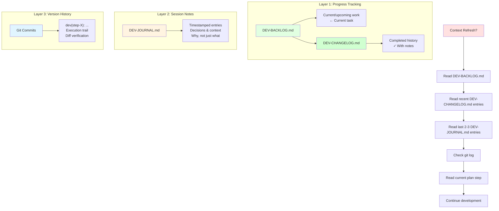

# 💻 Development Phase Guide

This document provides detailed guidance for the GraphMD development phase, including LLM context forgetting prevention strategies and the three-layer tracking approach.

## Development Phase Overview

The development phase implements your project based on the validated plan. This phase uses a **three-layer approach** to maintain LLM context across long sessions and prevent information loss when context windows refresh.

## Three-Layer Context Tracking

Uses **three-layer approach** to maintain context across long sessions:

## Layer 1: DEV-BACKLOG.md & DEV-CHANGELOG.md (Progress Tracking)

- **DEV-BACKLOG.md**: Current and upcoming work only
  - Mark `← CURRENT` for active step, `← NOW` for active subtask
  - Keep lean for quick reference
  - Move completed steps to DEV-CHANGELOG.md
- **DEV-CHANGELOG.md**: Historical record of completed work
  - Reverse chronological order (newest first)
  - Include completion date and notes
  - Provides context on what's been done
- First files to read on context refresh

## Layer 2: DEV-JOURNAL.md (Session Notes)

- Timestamped entries with decisions and context
- Why choices were made, not just what was done
- Last 2-3 entries provide narrative context
- Acts as handoff document between sessions

## Layer 3: Git Commits (Version History)

- Incremental commits after each subtask: `dev(step-X): description`
- Git log shows execution trail
- Diffs show what actually changed
- Provides verification of progress

## Validation

- Run `./templates/scripts/validate-dev.sh` periodically to check tracking status
- Shows completion percentage and progress bar
- Warns about missing commits or stale journal entries

## On Context Refresh

1. Run `./templates/scripts/validate-dev.sh` to check status
2. Read DEV-BACKLOG.md (current/upcoming work)
3. Read recent DEV-CHANGELOG.md entries (completed work context)
4. Read last 2-3 DEV-JOURNAL.md entries (decision context)
5. Read current plan step file
6. Check `git log --oneline -10` (recent work)

## Important Notes

**Note:** Ignore `<!-- seq-id: N -->` markers in plan files - they're planning phase artifacts only

## Getting Started

See [README.md](README.md#5-development-phase) for instructions on starting the development phase.

## 🔗 Related Documentation

- [README.md](README.md) - Main project documentation
- [PROJECT-STRUCTURE.md](PROJECT-STRUCTURE.md) - Project structure
- [templates/workflow/before-development.md](templates/workflow/before-development.md) - Development phase start instructions
- [templates/workflow/after-development.md](templates/workflow/after-development.md) - Development phase completion checklist
- [templates/scripts/validate-dev.sh](templates/scripts/validate-dev.sh) - Development validation script
