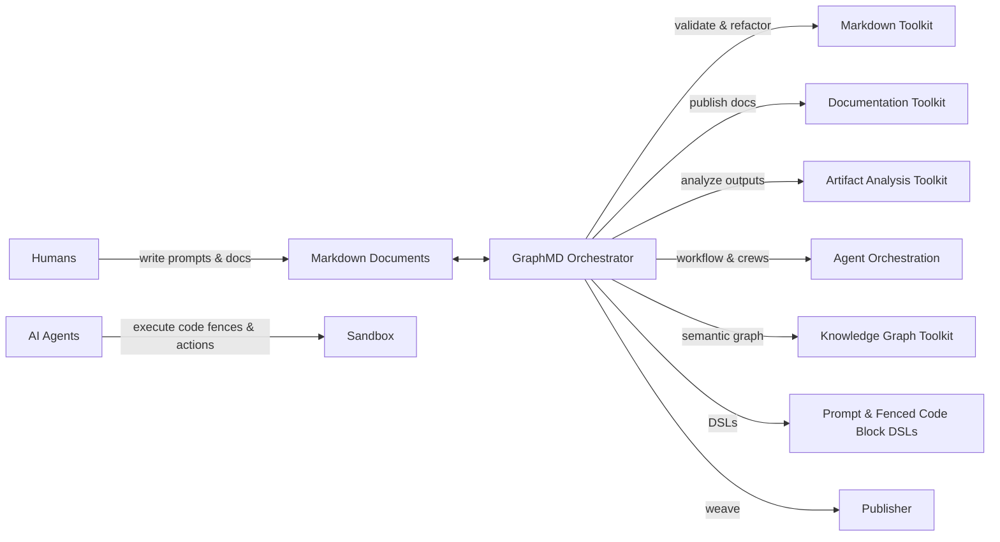

# GraphMD Ecosystem

GraphMD’s ecosystem is a collection of tools and services that make Markdown-Based Executable Knowledge Graphs (MBEKG) practical, reliable, and reproducible. It spans document tooling, execution, orchestration, analysis, and knowledge graph integration.

## Purpose and Scope

- Define the core components of the GraphMD ecosystem
- Explain how components interoperate through Markdown documents and Git
- Establish interfaces and conventions so components can evolve independently
- Provide a roadmap for each component’s maturity

## High-Level Architecture

## Components

### Publisher (planned)
- Purpose: Weave human-friendly documentation from Markdown sources and embedded artifacts.
- Capabilities: Cross-document weaving, navigation, artifact embedding, link integrity checks.
- Interfaces: Reads repository Markdown; outputs static site or PDF/HTML bundles.
- Status: Planned; initial spec tracked in `README.md` and `GLOSSARY.md`.

### Sandbox (planned)
- Purpose: Safe, provenance-aware execution environment for Agent actions and Markdown fenced code blocks.
- Capabilities: Execution isolation, resource limits, logging, artifact capture, reproducibility metadata.
- Interfaces: Executes fenced code blocks and declared actions; writes logs/artifacts referenced in Markdown.
- Status: Planned for v0.2 research/design.

### Markdown Toolkit
- Purpose: Quality, structure, and transformation utilities for Markdown as a primary artifact.
- Capabilities: Validation, generation, quality assurance, refactoring, encyclopedia/indexing.
- Interfaces: CLI and scripts (see `templates/scripts/`), pre-commit integration, library APIs (future).
- Status: Foundational scripts/templates available; expanded tools planned.

### Documentation Toolkit
- Purpose: Generate and publish documentation from Markdown sources.
- Capabilities: Site generation, link graph, section TOCs, changelog/backlog weaving.
- Interfaces: CLI pipeline; integrates with Publisher.
- Status: Planned.

### IDE Plugins for Popular IDEs
- Purpose: Provide native editor integrations for GraphMD workflows and DSLs.
- Capabilities: Syntax highlighting for DSLs and fenced blocks; linting/validation; inline run actions for fenced blocks; status decorations; link/ID validation; snippets/templates; hover documentation; command palette actions.
- Interfaces: Language Server Protocol (LSP) where applicable; CLI integration with GraphMD tools and the Sandbox; configuration via project files and front matter.
- Targets: VS Code (initial), JetBrains IDEs, Neovim.
- Status: Planned.

### Domain-Specific Language for Prompts
- Purpose: A concise, auditable syntax for specifying Agent tasks and constraints.
- Capabilities: Typed prompts, policies, input/output contracts, reproducible runs.
- Interfaces: Inline code fences and front matter; interpreted by Orchestrator/Agents.
- Status: Planned; design exploration in v0.2.

### Artifact Analysis Toolkit
- Purpose: Inspect, summarize, and validate artifacts produced by execution.
- Capabilities: Log parsing, metrics extraction, tables/plots, regression gates.
- Interfaces: Reads artifacts referenced in Markdown; writes summarized outputs back into documents.
- Status: Planned.

### Agent Workflow Orchestration Toolkit
- Purpose: Coordinate multi-step, multi-agent workflows from Markdown specifications.
- Capabilities: Task graphs, checkpoints, retries, policy checks, git-aware progress.
- Interfaces: Reads workflow sections; emits status updates and commit messages.
- Status: Planned.

### Agent Crew Management and Orchestration Toolkit
- Purpose: Manage roles, capabilities, and collaboration patterns among multiple agents.
- Capabilities: Role assignment, tool access policies, handoff protocols, review loops.
- Interfaces: Crew definitions in Markdown/front matter; orchestrated by the workflow toolkit.
- Status: Planned.

### Knowledge Graph Toolkit (RDF, OWL, etc.)
- Purpose: Bridge Markdown documents to semantic web standards.
- Capabilities: Extract typed entities/relations, generate RDF/OWL, validate with SHACL/OWL constraints.
- Interfaces: Markdown link/anchor/ID conventions; export/import pipelines.
- Status: Planned.

## Integration Model

1. Humans author Markdown documents (narrative-first) with fenced code blocks and prompt DSL sections.
2. Agents interpret prompts and execute code blocks via the Sandbox.
3. Artifacts (logs, tables, outputs) are saved and referenced back into documents.
4. Orchestrator runs validation and quality checks (Markdown Toolkit) and weaves/publishes results (Documentation Toolkit/Publisher).
5. Optional: Semantic exports via the Knowledge Graph Toolkit.
6. Everything is versioned in Git; pre-commit hooks validate critical invariants.

## Conventions and Interfaces

- Documents are the canonical source; execution is append-only with provenance.
- Fenced code blocks declare language/DSL; actions must be idempotent or guarded.
- Front matter and inline tags encode typing, provenance, and policy.
- Git workflows use branches per phase (`planning`, `development`) and conventional commits.

## Roadmap by Component

- v0.1 (current): Foundational workflow, templates, validation hooks, and documentation structure.
- v0.2 (research/design): Sandbox spec, Prompt/Fenced Code Block DSLs exploration, initial orchestration design, expanded Markdown Toolkit.
- v0.3+: Publisher implementation, Documentation Toolkit pipeline, Artifact Analysis, Knowledge Graph exports, crew/orchestration tooling.

## See Also

- `README.md` — Overview, workflow, and project status
- `GLOSSARY.md` — Definitions of core concepts and ecosystem components
- `templates/` — Scripts and workflow templates used throughout the ecosystem
