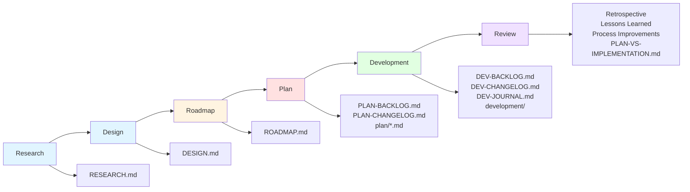

# 🌊 GraphMD Minimum Viable Product Workflow Guide

This document provides detailed guidance for each phase of the GraphMD MVP workflow. The workflow is designed for efficient project development with AI agents, ensuring thorough planning, consistent execution, and continuous improvement.

## Workflow Overview

**Complete workflow:** Research → Design → Roadmap → Plan → Development → Review

This workflow is highly effective for MVP development.

## Phase Documents

**Important:** Each prompt template document (`before-<phase>.md`, `after-<phase>.md`) is designed as a **self-contained prompt** to copy/paste into a new session.

### Prompt Safety Mechanism

All workflow prompts are **guarded by "Stand by for further instructions."** at the end. This:
- Prevents the Agent from taking unintended actions beyond the prompt's scope
- Ensures the Agent waits for your explicit next instruction
- Provides clear boundaries between workflow phases
- Allows you to review outputs before proceeding

## 1. Research Phase

**Recommendations:**
- Use **powerful slow models** with extended **thinking** enabled
- Produce **small, focused outputs** rather than large documents
- Take time to deeply understand the problem space

**Start:** Copy/paste `templates/workflow/before-research.md` content into the prompt.

**AI Agent:** Performs the research phase.

**Complete:** Copy/paste `templates/workflow/after-research.md` content to review your research.

### Research Focus

- **Domain Understanding** - Learn the problem space thoroughly
- **Constraints** - Identify technical, business, and resource limitations
- **Technologies** - Research relevant tools, frameworks, and approaches
- **Existing Solutions** - Study similar projects and their approaches
- **Risks** - Identify potential challenges early

## 2. Design Phase

**Start:** Copy/paste `templates/workflow/before-design.md` content into the prompt.

**AI Agent:** Creates a comprehensive system design including architecture, data models, and technical decisions.

**Complete:** Copy/paste `templates/workflow/after-design.md` content to review your design.

### Design Focus

- **System Architecture** - Define overall structure and components
- **Data Models** - Design entities, relationships, and schemas
- **Technology Stack** - Select frameworks, libraries, and tools
- **Integration Points** - Plan external services and APIs
- **Technical Decisions** - Document key choices and rationale

## 3. Roadmap Phase

**Start:** Copy/paste `templates/workflow/before-roadmap.md` content into the prompt.

**AI Agent:** Creates a high-level Roadmap with major phases, milestones, and dependencies.

**Complete:** Copy/paste `templates/workflow/after-roadmap.md` content to review your Roadmap.

### Roadmap Focus

- **Phases** - Break project into major phases
- **Milestones** - Define key deliverables and checkpoints
- **Dependencies** - Identify what depends on what
- **Priorities** - Rank features and capabilities
- **Timeline** - Estimate rough timeframes

## 4. Planning Phase

**Start a new Agent session** and copy/paste `templates/workflow/before-plan.md` content into the prompt.

**AI Agent:** Creates a detailed, multi-step plan in the `plan/` directory. Runs the `validate-plan.sh` script to check progress and tracking status.

**Complete:** Copy/paste `templates/workflow/after-plan.md` content to review and validate your plan.

### Planning Focus

- **Step-by-Step Plan** - Break down each phase into actionable steps
- **Validation** - Use `validate-plan.sh` to ensure plan quality
- **Sequence Markers** - Include exactly 3 markers per plan file
- **Reproducibility** - Make steps clear and unambiguous
- **PLAN-BACKLOG.md** - Track current and upcoming plan work
- **PLAN-CHANGELOG.md** - Record validated plan steps

See [PLANNING-PHASE.md](PLANNING-PHASE.md) for detailed planning guidance.

## 5. Development Phase

**Important:** Use independent Agent sessions for Plan and Development phases to ensure fresh context and avoid confusion.

**Start a new Agent session** and copy/paste `templates/workflow/before-development.md` content into the prompt.

**AI Agent:** Develops the project in the `development/` directory. Runs the `validate-dev.sh` script to check progress and tracking status.

**Complete:** Copy/paste `templates/workflow/after-development.md` content to document any inconsistencies between plan and development.

### Development Focus

- **Three-Layer Context Tracking** - Use backlog, journal, and Git commits
- **DEV-BACKLOG.md** - Track current and upcoming development work
- **DEV-CHANGELOG.md** - Record completed implementation steps
- **DEV-JOURNAL.md** - Document decisions and context
- **Validation** - Use `validate-dev.sh` to check progress
- **Incremental Commits** - Commit after each meaningful subtask

### Report

**Purpose:** Document what was built versus what was planned, including any deviations and their rationale.

**Output:** `PLAN-VS-IMPLEMENTATION.md`

#### What to Include

- **Summary** - Overview of what was accomplished
- **Plan vs. Reality** - What matched and what differed
- **Deviations** - Why changes were made from the original plan
- **Outcomes** - Results, metrics, and deliverables
- **Lessons Learned** - What worked well and what didn't

See [DEVELOPMENT-PHASE.md](DEVELOPMENT-PHASE.md) for detailed development guidance.

## 6. Review Phase

**Purpose:** Conduct a retrospective to identify improvements and learn from the process.

**Important:** This phase is exclusively for human review and reflection, not AI execution.

### What to Review

- **What Worked Well** - Celebrate successes and effective practices
- **Lessons Learned** - Identify insights and knowledge gained
- **Process Improvements** - Suggest changes for future iterations
- **Action Items** - Define concrete steps for improvement
- **Documentation Updates** - Update templates and guides based on learnings

## Best Practices

### Phase Separation

- Use **independent Agent sessions** for Plan and Development phases
- This ensures fresh context and prevents confusion between planning and execution

### Research Phase

- Favor **slow models with thinking** enabled for deeper analysis
- Keep outputs **focused and concise**
- Quality of understanding matters more than speed

### Fresh Sessions

Starting new sessions for key phases (Planning, Development) helps:
- Prevent context pollution from previous phases
- Ensure the AI focuses on the current phase's goals
- Reduce confusion between planning and execution modes

### Validation

- Run validation scripts regularly during Planning and Development
- Fix issues immediately rather than accumulating technical debt
- Use validation output to guide next steps

## 🔗 Related Documentation

- [README.md](README.md) - Main project documentation
- [RESEARCH-PHASE.md](RESEARCH-PHASE.md) - Detailed research phase guidance
- [DESIGN-PHASE.md](DESIGN-PHASE.md) - Detailed design phase guidance
- [ROADMAP-PHASE.md](ROADMAP-PHASE.md) - Detailed roadmap phase guidance
- [PLANNING-PHASE.md](PLANNING-PHASE.md) - Detailed planning guidance
- [DEVELOPMENT-PHASE.md](DEVELOPMENT-PHASE.md) - Development phase guidance
- [MVP-DEVELOPMENT.md](MVP-DEVELOPMENT.md) - MVP development best practices
- [TEMPLATES.md](TEMPLATES.md) - Template examples
