# 🧭 Planning Phase Guide

This document provides detailed guidance for the GraphMD planning phase, including best practices and the plan validation state machine for LLM context tracking (context forgetting prevention).

## Planning Phase Overview

The planning phase creates a detailed, validated, step-by-step plan for implementing your project. This phase uses a validation state machine to ensure plan quality and prevent context forgetting during long sessions.

## Context Tracking

- Create `PLAN-BACKLOG.md` first to track current/pending plan work
- Create `PLAN-CHANGELOG.md` to maintain history of validated steps
- Mark steps `[x]` when they pass validation, then move to PLAN-CHANGELOG.md
- Keep `PLAN-BACKLOG.md` lean with only current/upcoming work
- On validation failure: read 2-3 random validated plan files from `PLAN-CHANGELOG.md`, then all unchecked files from `PLAN-BACKLOG.md`
- No other files should be created or modified (except `PLAN-BACKLOG.md`, `PLAN-CHANGELOG.md`, and plan files)
- The plan must be fully reproducible by someone else following it end-to-end
- **Important:** Sequence markers (`<!-- seq-id: N -->`) are for planning phase context tracking only

## Plan Validation State Machine

The planning phase implements a **state machine** to prevent context forgetting during long sessions:

```mermaid
stateDiagram-v2
    [*] --> RunValidation: START PLANNING
    
    RunValidation: Run validate-plan.sh
    Validation: Check Result
    
    RunValidation --> Validation
    
    Validation --> Pass: ✓ PASS
    Validation --> Warn: ⚠ WARN
    Validation --> Fail: ✗ FAIL
    
    Fail --> ContextRefresh: Possible context forgetting detected
    
    ContextRefresh: Context forgetting prevention
    note right of ContextRefresh
        • Re-read PLAN-BACKLOG.md
        • Re-read before-plan.md
        • Re-read DESIGN.md & ROADMAP.md
        • Re-read 2-3 random validated plan files
          from PLAN-CHANGELOG.md (examples)
        • Re-read all unchecked files
          from PLAN-BACKLOG.md
        • Fix issues
    end note
    
    ContextRefresh --> RunValidation: Retry validation
    Warn --> CreateStep: Continue with warning
    Pass --> MarkCompleted: Mark [x] & Move to PLAN-CHANGELOG.md
    
    MarkCompleted --> CreateStep
    
    CreateStep: Create Next Plan Step
    AppendReminder: Append reminder to the prompt response
    note right of AppendReminder
        Run validate-plan.sh
        before next step
    end note
    
    CreateStep --> AppendReminder
    AppendReminder --> RunValidation: Next iteration
```

## Key Features

- **PLAN-BACKLOG.md tracking** - Current/pending work only, quick overview
- **PLAN-CHANGELOG.md history** - Validated steps with timestamps and notes
- **Smart re-reading** - Read 2-3 random validated files from `PLAN-CHANGELOG.md` for context/examples, plus all unchecked files from `PLAN-BACKLOG.md`
- **Cognitive diversity** - Random sampling prevents pattern fixation and provides fresh perspective
- **Validation before each step** ensures correctness incrementally
- **Context refresh on failure** prevents drift and forgetting
- **Global sequence markers** track progress across context windows
- **Lean BACKLOG** - Moving completed work to CHANGELOG keeps BACKLOG focused

## Why This Matters

This state machine is crucial for **long planning sessions** where context windows may refresh, ensuring the AI agent always has current, accurate context while minimizing redundant re-reading.

## Getting Started

See [README.md](README.md#4-planning-phase) for instructions on starting the planning phase.

## 🔗 Related Documentation

- [README.md](README.md) - Main project documentation
- [PROJECT-STRUCTURE.md](PROJECT-STRUCTURE.md) - Project structure
- [templates/workflow/before-plan.md](templates/workflow/before-plan.md) - Planning phase start instructions
- [templates/workflow/after-plan.md](templates/workflow/after-plan.md) - Planning phase completion checklist
- [templates/scripts/validate-plan.sh](templates/scripts/validate-plan.sh) - Plan validation script
