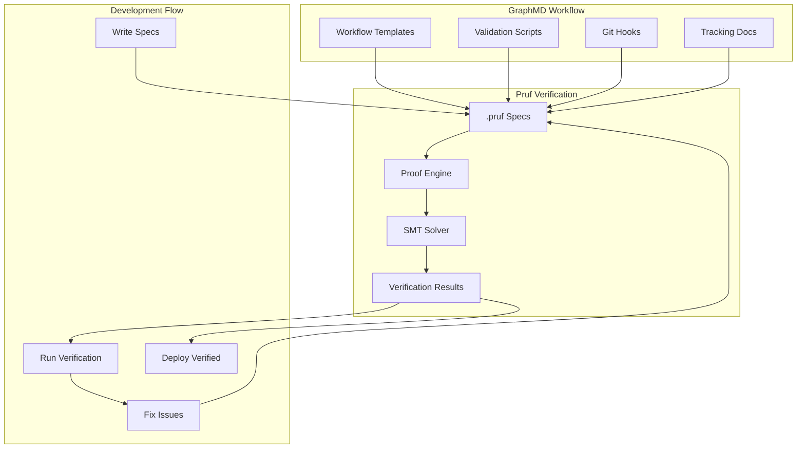

# Pruf - Formal Verification Language for GraphMD

**Mathematically proven workflows for AI-assisted development**

**Version:** 0.1 (Specification)  
**Status:** Research & Design Phase  
**License:** MIT-0 / CC0-1.0

## Table of Contents

- [Overview](#overview)
- [Etymology](#etymology)
- [Theoretical Foundation](#theoretical-foundation)
- [Why Pruf?](#why-pruf)
- [Language Syntax](#language-syntax)
- [Core Concepts](#core-concepts)
- [Verification Examples](#verification-examples)
- [Integration with GraphMD](#integration-with-graphmd)
- [Tooling](#tooling)
- [Implementation Roadmap](#implementation-roadmap)
- [Related Work](#related-work)

---

## Overview

**Pruf** (from German "prüfen" - to verify, to check, to test) is a Domain-Specific Language (DSL) for formal verification of GraphMD workflows and AI-assisted development processes.

Built on [Sulise](https://github.com/pyralog/pyralog/blob/main/BATUTA.md#theoretical-foundation-sulise) - Pyralog's category theory-based mathematical framework - Pruf provides:

- **Formal specifications** of workflow states and transitions
- **Mathematical proofs** of correctness
- **Automated verification** using SMT solvers
- **Runtime validation** with invariant checking
- **Visual proof inspection** for debugging

### Design Goals

1. **Correctness** - Mathematically prove workflow properties
2. **Safety** - Prevent invalid states at compile time
3. **Clarity** - Specifications serve as precise documentation
4. **Usability** - Intuitive syntax for developers
5. **Integration** - Seamless with existing GraphMD tools

---

## Etymology

**Pruf** /pruːf/ derives from:

- **German**: *prüfen* - to verify, to test, to examine, to check
- **German**: *Prüfung* - test, examination, verification
- **Dutch**: *proef* - test, trial, proof
- **English**: Similar to *proof* - evidence, verification

The name embodies:
- ✅ German engineering precision
- ✅ Mathematical rigor
- ✅ Quality assurance culture
- ✅ Cross-linguistic accessibility

---

## Theoretical Foundation

Pruf is built on **Sulise**, a category theory-based framework from Pyralog's Batuta language.

### What is Sulise?

Sulise provides:
- **Categorical semantics** for workflows and data transformations
- **Formal composition** rules for operations
- **Type-safe transformations** between computational models
- **Mathematical proofs** of correctness

Reference: [Batuta - Sulise Documentation](https://github.com/pyralog/pyralog/blob/main/BATUTA.md#theoretical-foundation-sulise)

### Category Theory Model

In Pruf, workflows are modeled as categories:

- **Objects** = Workflow states (Initial, Planning, Development, Complete)
- **Morphisms** = State transitions (init, validate, develop, complete)
- **Composition** = Chaining transitions with laws (associativity, identity)

```mermaid
graph LR
    subgraph "Objects (States)"
        O1[Initial]
        O2[Planning]
        O3[Development]
        O4[Complete]
    end
    
    subgraph "Morphisms (Transitions)"
        M1[init]
        M2[validate]
        M3[develop]
        M4[complete]
    end
    
    O1 -->|M1| O2
    O2 -->|M2| O3
    O3 -->|M3| O4
    
    subgraph "Category Laws"
        L1[Identity: id ∘ f = f]
        L2[Associativity: f ∘ g ∘ h = f ∘ (g ∘ h)]
        L3[Composition: g ∘ f]
    end
```

---

## Why Pruf?

GraphMD workflows involve:
1. **Complex state transitions** (planning → development)
2. **Context tracking** across multiple documents
3. **Validation checkpoints** that must be verified
4. **LLM interactions** with potential failure modes
5. **Git workflow** with branch and commit requirements

**Without formal verification:**
- ❌ Hidden invalid states
- ❌ Context loss bugs
- ❌ Validation gaps
- ❌ Race conditions

**With Pruf:**
- ✅ Workflows cannot reach invalid states
- ✅ Context is mathematically proven to be preserved
- ✅ Validation rules are always enforced
- ✅ State transitions are proven correct

---

## Language Syntax

Pruf uses a Clojure-inspired Lisp syntax for readability and composability.

### File Extension

```
.pruf       - Pruf specification files
.pruf.md    - Literate Pruf (Markdown-embedded)
```

### Basic Structure

```clojure
;; Pruf specification file

;; Define workflow
(defworkflow workflow-name
  "Documentation string"
  
  ;; States
  (defstate :state-name
    :invariants [predicate1 predicate2])
  
  ;; Transitions
  (deftransition name [from-state → to-state]
    :preconditions [...]
    :postconditions [...])
  
  ;; Verification goals
  (prove-property "Property description"))
```

### Comments

```clojure
;; Single-line comment

;; Multi-line comments
(comment
  This is a block comment
  for documentation purposes)
```

---

## Core Concepts

### 1. States

States represent distinct phases in a workflow.

```clojure
(defstate :planning
  "Planning phase where steps are created and validated"
  
  :invariants [
    ;; Backlog exists and is valid
    (valid-backlog? backlog)
    
    ;; Changelog records completed steps
    (valid-changelog? changelog)
    
    ;; Sequence markers are correct
    (sequence-markers-correct? backlog)
  ]
  
  :properties {
    :phase "planning"
    :branch "planning"
    :tracking ["PLAN-BACKLOG.md" "PLAN-CHANGELOG.md"]
  })
```

### 2. Transitions

Transitions move between states with verified conditions.

```clojure
(deftransition validate [:planning → :planning]
  "Validate a plan step with context recovery on failure"
  
  :preconditions [
    (has-pending-steps? backlog)
    (validation-script-exists?)
  ]
  
  :postconditions [
    (or (step-validated? step)
        (context-refreshed?))
  ]
  
  :effects [
    (when (validated? step)
      (move-to-changelog step))
  ])
```

### 3. Invariants

Invariants are properties that must always hold.

```clojure
(definvariant backlog-changelog-sync
  "Backlog and changelog stay consistent"
  
  (∀ [step]
    (→ (completed? step changelog)
        (removed? step backlog))))
```

### 4. Verification Goals

Goals specify what to prove about the system.

```clojure
;; Prove termination
(prove-termination "All workflows eventually complete"
  :measure (count-pending-steps)
  :bound max-steps)

;; Prove safety
(prove-safety "No invalid states reachable"
  (∀ [state]
    (reachable? state) → (valid? state)))

;; Prove liveness
(prove-liveness "Progress always possible"
  (∀ [state]
    (not-complete? state) → (∃ [transition] (enabled? transition))))
```

### 5. Context Systems

Model multi-layer context tracking.

```clojure
(defcontext-system three-layer
  "Three-layer context tracking for GraphMD"
  
  (deflayer backlog
    :properties [:current-work :priorities]
    :invariants [(no-duplicates? :steps)
                 (valid-sequence? :markers)])
  
  (deflayer changelog
    :properties [:completed :validated]
    :invariants [(monotonic-increase? :count)
                 (timestamped? :entries)])
  
  (deflayer journal
    :properties [:decisions :learnings]
    :invariants [(session-bounded? :entries)]))
```

---

## Verification Examples

### Example 1: Planning Phase Correctness

```clojure
(defworkflow graphmd-planning
  "Formal specification of GraphMD planning phase"
  
  ;; States
  (defstate :initial
    :invariants [(empty? backlog)
                 (empty? changelog)])
  
  (defstate :planning
    :invariants [(valid-backlog? backlog)
                 (valid-changelog? changelog)
                 (sequence-markers-correct? backlog)])
  
  (defstate :complete
    :invariants [(empty? backlog)
                 (all-validated? changelog)])
  
  ;; Transitions
  (deftransition init [:initial → :planning]
    :preconditions [(project-initialized?)]
    :postconditions [(backlog-created?)
                     (workflow-loaded?)])
  
  (deftransition validate [:planning → :planning]
    :preconditions [(has-pending-steps? backlog)]
    :postconditions [(or (step-validated? step)
                         (context-refreshed?))])
  
  (deftransition complete [:planning → :complete]
    :preconditions [(empty? backlog)]
    :postconditions [(ready-for-development?)])
  
  ;; Verification goals
  (prove-termination "Planning eventually completes")
  (prove-safety "No invalid states reachable")
  (prove-liveness "Progress always possible"))
```

### Example 2: Context Preservation Proof

```clojure
(deftheorem context-preservation
  "Context is never lost across sessions"
  
  (∀ [session₁ session₂]
    (→ (follows? session₂ session₁)
        (⊆ (context session₁)
           (context session₂))))
  
  ;; Proof sketch
  (proof
    (assume (follows? session₂ session₁))
    
    (step 1 "Session₁ writes to tracking documents"
      (updates session₁ [backlog changelog journal]))
    
    (step 2 "Tracking documents persisted to disk"
      (persisted? [backlog changelog journal]))
    
    (step 3 "Session₂ reads tracking documents"
      (reads session₂ [backlog changelog journal]))
    
    (step 4 "All information from session₁ available"
      (= (read session₂) (written session₁)))
    
    (conclude
      (⊆ (context session₁)
         (context session₂)))
    
    :qed))
```

### Example 3: Validation Loop Termination

```clojure
(defstatemachiine validation-loop
  "Recursive validation with guaranteed termination"
  
  (defstate :validate
    :entry [(check-sequence)
            (verify-files)
            (enforce-rules)])
  
  (defstate :pass
    :entry [(update-tracking)])
  
  (defstate :fail
    :entry [(refresh-context)
            (reload-instructions)])
  
  ;; Transitions
  (transition :validate → :pass
    :when (all-checks-pass?))
  
  (transition :validate → :fail
    :when (any-check-fails?))
  
  (transition :fail → :validate
    :when (context-restored?)
    :increment refresh-count)
  
  ;; Termination proof
  (prove-termination
    "Validation loop always terminates"
    
    :measure refresh-count
    :bound 3
    
    (proof
      (invariant (≤ refresh-count 3))
      
      (case 1 "If validation passes, terminates immediately"
        (→ (all-checks-pass?)
            (terminates)))
      
      (case 2 "If validation fails ≤ 3 times, context refreshes"
        (→ (< refresh-count 3)
            (eventually (all-checks-pass?))))
      
      (case 3 "After 3 failures, system reports error"
        (→ (≥ refresh-count 3)
            (error-exit)))
      
      (conclude (always-terminates))
      :qed)))
```

### Example 4: Backlog-Changelog Synchronization

```clojure
(definvariant backlog-changelog-sync
  "Backlog and changelog stay synchronized"
  
  (∀ [step]
    (exclusive-or
      (in-backlog? step)
      (in-changelog? step)))
  
  (proof
    ;; Base case: Initially both empty
    (assume (and (empty? backlog)
                 (empty? changelog)))
    
    ;; Step 1: Adding to backlog
    (when (add-to-backlog step)
      (assert (in-backlog? step))
      (assert (not (in-changelog? step))))
    
    ;; Step 2: Validating step
    (when (validate step)
      (assert (still-in-backlog? step)))
    
    ;; Step 3: Moving to changelog
    (when (move-to-changelog step)
      (transaction
        (remove-from-backlog step)
        (add-to-changelog step))
      
      ;; Atomic transaction ensures consistency
      (assert (not (in-backlog? step)))
      (assert (in-changelog? step)))
    
    (conclude
      "Step is in exactly one location at all times")
    :qed))
```

### Example 5: LLM Prompt-Response Contract

```clojure
(defcontract llm-validation-interaction
  "Contract for LLM validation interactions"
  
  :requires [
    ;; Preconditions
    (loaded-context? [backlog changelog workflow])
    (validation-script-executable?)
  ]
  
  :ensures [
    ;; Postconditions
    (validation-result-valid?)
    (or (validation-passed?)
        (context-refresh-triggered?))
  ]
  
  :invariants [
    ;; Must hold throughout
    (context-accessible?)
    (tracking-docs-consistent?)
  ]
  
  ;; Verification
  (prove-contract-adherence
    (∀ [llm-call]
      (and (satisfies-requires? llm-call)
           (→ (executes llm-call)
               (satisfies-ensures? (result llm-call)))))))
```

---

## Integration with GraphMD



### Workflow Integration

```bash
# Project structure
graphmd-project/
├── workflow/
│   ├── before-plan.md
│   └── after-plan.md
├── scripts/
│   ├── validate-plan.sh
│   └── validate-dev.sh
├── verification/           # New: Pruf specifications
│   ├── planning.pruf
│   ├── development.pruf
│   ├── context-tracking.pruf
│   └── validation-loops.pruf
└── Makefile
```

### Makefile Integration

```makefile
# Verify workflow specifications
verify:
	pruf verify verification/

# Verify specific property
verify-planning:
	pruf verify verification/planning.pruf

# Generate proof visualization
verify-visual:
	pruf verify --visual --output docs/proofs.svg

# Runtime verification mode
validate-formal:
	pruf validate --runtime --watch

# All verification
.PHONY: verify-all
verify-all: verify test lint
```

---

## Tooling

### Command-Line Interface

```bash
# Install Pruf
cargo install pruf

# Verify specifications
pruf verify <file.pruf>

# Verify directory
pruf verify workflow/

# Check specific theorem
pruf verify --theorem planning-phase-correct

# Generate proof visualization
pruf verify --visual --output proof.svg

# Watch mode (continuous verification)
pruf watch verification/

# Runtime verification
pruf validate --runtime --script validate-plan.sh

# REPL for interactive proving
pruf repl
```

### REPL Example

```clojure
$ pruf repl
Pruf 0.1.0 - Formal Verification REPL
Connected to GraphMD project: /Users/artbin/graphmd

pruf> (load "verification/planning.pruf")
Loaded: graphmd-planning workflow

pruf> (verify 'planning-phase-correct)
Verifying: planning-phase-correct
  ✓ Termination: All workflows eventually complete
  ✓ Safety: No invalid states reachable
  ✓ Liveness: Progress always possible
✓ Theorem proven

pruf> (show-proof 'planning-phase-correct)
Proof Tree:
  planning-phase-correct
  ├─ termination
  │  └─ by-induction [steps]
  │     ├─ base-case: empty-backlog ✓
  │     └─ inductive-step ✓
  ├─ safety
  │  └─ by-invariant-checking ✓
  └─ liveness
     └─ by-transition-availability ✓

pruf> (export-proof "docs/planning-proof.md")
Exported proof to: docs/planning-proof.md
```

### IDE Integration

**VS Code Extension: `pruf-lang`**
- Syntax highlighting
- Inline proof status
- Quick fixes for proof failures
- Proof tree visualization
- Hover documentation

**Language Server Protocol (LSP)**
```json
{
  "pruf.enabled": true,
  "pruf.verifyOnSave": true,
  "pruf.prover": "z3",
  "pruf.timeout": 30
}
```

---

## Implementation Roadmap

### Phase 1: Core Language (3-4 months)
- ✅ Syntax design
- ✅ Parser (S-expression)
- ✅ AST representation
- ⬜ Type system
- ⬜ Basic verification engine

### Phase 2: Proof Engine (4-5 months)
- ⬜ SMT solver integration (Z3)
- ⬜ Proof generation
- ⬜ Automated theorem proving
- ⬜ Counterexample generation
- ⬜ Proof certification

### Phase 3: GraphMD Integration (2-3 months)
- ⬜ Workflow specification templates
- ⬜ Validation script verification
- ⬜ Runtime verification hooks
- ⬜ Git workflow integration
- ⬜ Documentation generation

### Phase 4: Tooling (3-4 months)
- ⬜ CLI implementation
- ⬜ REPL with interactive proving
- ⬜ VS Code extension
- ⬜ LSP server
- ⬜ Proof visualization

### Phase 5: Advanced Features (4-5 months)
- ⬜ Distributed system verification
- ⬜ Temporal logic support
- ⬜ Probabilistic verification
- ⬜ Machine-checkable proofs
- ⬜ Proof search strategies

### Phase 6: Production Ready (3-4 months)
- ⬜ Performance optimization
- ⬜ Standard library
- ⬜ Documentation
- ⬜ Tutorial and examples
- ⬜ Community building

**Total Timeline: ~19-25 months**

---

## Related Work

### Verification Tools

| Tool | Type | Domain | Comparison to Pruf |
|------|------|--------|-------------------|
| **TLA+** | Temporal logic | Distributed systems | More expressive, less integrated |
| **Coq** | Proof assistant | General | More powerful, steeper learning curve |
| **Isabelle** | Proof assistant | General | Academic focus, complex |
| **Alloy** | Relational logic | Models | Bounded verification only |
| **Dafny** | Programming language | Software | Language-specific, not DSL |
| **Why3** | Platform | Verification | Good inspiration for architecture |
| **F★** | Proof-oriented lang | Software | Similar goals, different approach |

### Category Theory Foundations

| Framework | Focus | Relation to Pruf |
|-----------|-------|------------------|
| **Sulise** | Data transformations | Pruf's foundation |
| **Catlab.jl** | Applied category theory | Similar mathematical basis |
| **Ologs** | Ontology logs | Related modeling approach |

### Differentiators

**Pruf is unique because:**
1. ✅ Built specifically for AI-assisted workflow verification
2. ✅ Based on Sulise (category theory for data systems)
3. ✅ Integrated with GraphMD literate programming
4. ✅ Focus on LLM context preservation
5. ✅ Markdown-first documentation approach

---

## Contributing

Pruf is part of the GraphMD project and follows the same contribution guidelines.

### Development Setup

```bash
# Clone repository
git clone https://github.com/graphmd-lpe/graphmd
cd graphmd/pruf

# Build Pruf compiler
cargo build

# Run tests
cargo test

# Install locally
cargo install --path .
```

### Project Structure

```
pruf/
├── src/
│   ├── parser.rs        # S-expression parser
│   ├── ast.rs           # Abstract syntax tree
│   ├── types.rs         # Type system
│   ├── verify.rs        # Verification engine
│   ├── smt.rs           # SMT solver interface
│   ├── proof.rs         # Proof generation
│   └── repl.rs          # Interactive REPL
├── examples/            # Example specifications
├── tests/               # Test suite
└── docs/                # Documentation
```

---

## References

1. **Sulise Framework**: https://github.com/pyralog/pyralog/blob/main/BATUTA.md
2. **GraphMD**: https://github.com/graphmd-lpe/graphmd
3. **Category Theory for Programmers**: Bartosz Milewski
4. **Types and Programming Languages**: Benjamin Pierce
5. **Software Foundations**: Coq Development Team

---

## License

Pruf is dual-licensed:
- **Source code**: MIT-0 (MIT No Attribution)
- **Documentation**: CC0-1.0 (Public Domain)

Use freely, modify, distribute. No attribution required.

---

## Acknowledgments

- **Pyralog** - For Sulise theoretical foundation
- **GraphMD** - For literate programming context
- **Batuta** - For category theory inspiration
- **TLA+, Coq, Dafny** - For verification techniques

---

**Pruf** brings mathematical rigor to AI-assisted development. 🎯

**prüfen** → verify → trust → **pruf**

---

**Documentation**: https://graphmd-lpe.github.io/pruf  
**GitHub**: https://github.com/graphmd-lpe/graphmd  
**Discord**: Join GraphMD community  

*Built with ❤️ for reproducible AI-assisted development*

