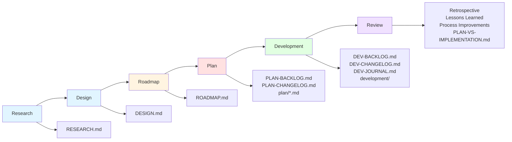
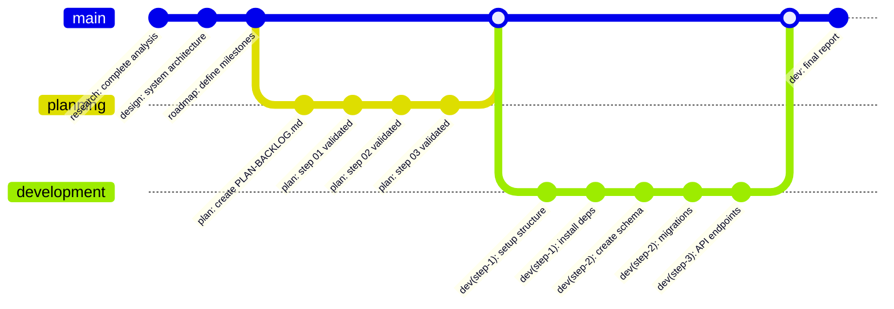

# GraphMD — Literate Programming Environment for Markdown-Based Executable Knowledge Graphs

[](LICENSES/MIT-0.txt)
[](LICENSES/CC0-1.0.txt)
[](https://github.com/graphmd-lpe/graphmd)

## 📜 Manifesto

1. As of today, the term `AI` is overhyped, and 99% of content about `AI` is nothing more than marketing bullshit (the bubble).
2. The backbone of what is called `AI` is just optimized statistical models.
3. An `LLM` is a statistical model for generating templates, trained on large text datasets.
4. You should review hard the output of any `LLM` before using it.
5. **GraphMD is anti-AGI.** We don't believe in or pursue Artificial General Intelligence. Instead, we focus on practical, verifiable, human-supervised AI assistance.

This project attempts to formalize the process of using `LLM`s as template generators in a reliable, reproducible, and reviewable way.

### 🎯 Anti-AGI Positioning

**GraphMD explicitly rejects the AGI narrative.**

- ❌ **Not pursuing AGI** - We don't believe current approaches lead to general intelligence
- ❌ **Not autonomous agents** - Humans must always be in control
- ❌ **Not "thinking machines"** - LLMs are statistical pattern generators, not minds
- ✅ **Human-supervised assistance** - AI as a tool, not a replacement
- ✅ **Verifiable workflows** - Every step reviewed and validated
- ✅ **Reproducible processes** - Documented, testable, auditable
- ✅ **Mathematical rigor** - Formal verification over blind trust

**Why anti-AGI matters:**
1. **Safety** - Structured workflows prevent runaway automation
2. **Accountability** - Humans responsible for all decisions
3. **Quality** - Review and validation ensure correctness
4. **Honesty** - We don't promise what we can't deliver
5. **Focus** - Build practical tools, not science fiction

**Our approach:** Treat LLMs as sophisticated autocomplete, not artificial minds. Use them within formal structures that guarantee human oversight, validation, and control.

**Author:** Artem Kulyabin

## 📖 Overview

**GraphMD** is a Literate Programming Environment (LPE) where the Markdown document is the primary artifact. It enables bidirectional integration between AI Agents and the Literate Programming Environment, transforming Markdown documents into executable specifications through a collaborative intelligence model where humans write prompts, AI Agents perform actions, GraphMD orchestrates, and knowledge emerges.

### The Knowledge Loop

**Humans** write prompts → **AI Agents** perform actions → **GraphMD** orchestrates → **Knowledge** emerges

## 🎯 Core Concept

**Markdown documents become executable** — AI Agents read prompts and Markdown documents, perform actions (extract knowledge, generate new Markdown documents, execute fenced code blocks, etc.), and interpret results. GraphMD provides the environment to orchestrate these interactions.

### ♻️ Core Principle

- Don't Repeat Others and Don't Reinvent the Wheel
  - Reuse standards, tools, and prior work; integrate and reference rather than duplicating or rebuilding without strong justification.

## 🧠 Markdown-Based Executable Knowledge Graphs (MBEKG)

**Definition:** MBEKG are knowledge graphs whose canonical source is human-readable Markdown that's also machine-executable. Documents and sections encode entities and relations; fenced code blocks and commands define behaviors that can be executed by agents.

**Core building blocks:**
- **Documents/sections as nodes** — Typed sections represent entities, concepts, or processes
- **Links as edges** — Markdown links, anchors, and IDs connect entities and encode relations
- **Metadata** — Front matter and inline tags provide typing, provenance, and policy context
- **Executable blocks** — Code fences and commands perform checks, queries, generation, and transforms
- **Artifacts as first-class** — Results (logs, tables, files, etc.) are referenced back into the documents

**Execution model:** Agents interpret Markdown, execute declared actions, materialize results, and write findings back into the graph. GraphMD orchestrates execution, validation, and provenance so the graph remains consistent as it evolves.

**Properties:**
- **Human-readable, machine-executable** — A single source for understanding and automation
- **Traceable and reproducible** — Append-only evolution with provenance of prompts, actions, and outputs
- **Policy-checked** — Consistency and quality rules run as part of the loop
- **Bidirectional collaboration** — Humans describe and review; Agents execute and analyze

## ✍️ Literate Programming in GraphMD

**Literate Programming** treats programs as literature for humans, interleaving narrative and code so that readers understand the why and how together. In GraphMD, the Markdown document is the primary artifact, and execution is driven from within the prose.

**How GraphMD applies literate programming:**
- **Narrative-first documents** — Prompts, rationale, and design live alongside executable fenced code blocks
- **Executable code fences** — Agents execute commands directly from Markdown
- **Weave and tangle model** — **Publisher (planned)** weaves human-friendly docs; **Sandbox (planned)** tangles and serves as a safe, provenance-aware execution environment for Agent actions and Markdown fenced code blocks
- **Provenance-aware updates** — Prompts, results, and decisions are recorded in-place for reproducibility

Links:
- [“Literate Programming” (1984), *The Computer Journal* (PDF)](https://academic.oup.com/comjnl/article-pdf/27/2/97/981657/270097.pdf)
- [*Literate Programming* (1992 book) — Knuth’s Stanford page](https://www-cs-faculty.stanford.edu/~knuth/lp.html)

## 🚀 Getting Started

This guide will help you set up GraphMD and start using the workflow to guide AI-driven development. You'll learn how to begin collaborating with AI Agents through the structured phase-by-phase workflow.

### Prerequisites

- **Bash** - For running validation scripts
- **Git** - For version control
- **Agent** - Any AI coding assistant

### Quick Start

#### 1. Clone the Repository

```bash
# Clone the main repository 
git clone https://github.com/graphmd-lpe/graphmd.git
cd graphmd

# Copy workflow templates to your project
cp -r templates/workflow /path/to/project/workflow/

# Copy validation scripts to your project
cp -r templates/scripts /path/to/project/scripts/

cd /path/to/project

# Initialize Git repository if not already initialized
git init

# Add the templates to the repository
git add workflow/ scripts/

# Create the initial commit
git commit -m "graphmd: add workflow templates and validation scripts"
```

#### 2. Follow the Workflow

**Research phase:**
1. Copy `workflow/before-research.md` content
2. Paste it into your Agent prompt to start the research phase
3. Collaborate with the Agent to research the problem domain, requirements, and constraints
4. Copy `workflow/after-research.md` content
5. Paste it into your Agent prompt to review and commit the research

**Design phase:**
1. Copy `workflow/before-design.md` content
2. Paste it into your Agent prompt to start the design phase
3. Collaborate with the Agent to create system architecture, data models, and technical decisions
4. Copy `workflow/after-design.md` content
5. Paste it into your Agent prompt to review and commit the design

**Roadmap phase:**
1. Copy `workflow/before-roadmap.md` content
2. Paste it into your Agent prompt to start the roadmap phase
3. Collaborate with the Agent to define high-level phases, milestones, and dependencies
4. Copy `workflow/after-roadmap.md` content
5. Paste it into your Agent prompt to review and commit the roadmap

**Planning phase:**
1. Copy `workflow/before-plan.md` content
2. Paste it into a **new Agent session** to start the planning phase
3. Collaborate with the Agent as it creates a `planning` branch and develops a detailed plan
4. Copy `workflow/after-plan.md` content
5. Paste it into your Agent prompt to validate, commit, and merge the `planning` branch

**Development phase:**
1. Copy `workflow/before-development.md` content
2. Paste it into a **new Agent session** to start the development phase
3. Collaborate with the Agent as it creates a `development` branch and implements your plan
4. Copy `workflow/after-development.md` content
5. Paste it into your Agent prompt to review, document, and merge the `development` branch

### Understanding the Workflow

The GraphMD workflow consists of **6 phases**, each with its own purpose:

1. **Research** - Understand the problem space deeply
2. **Design** - Create system architecture and technical decisions
3. **Roadmap** - Define high-level phases and milestones
4. **Plan** - Create detailed, validated implementation plans
5. **Development** - Generate a codebase
6. **Review** - Retrospective and process improvements. Compare plan vs. implementation

Each phase uses **before/after prompt templates** that you copy and paste into your Agent session as self-contained prompts.

**Prompt Safety:** All workflow prompts end with **"Stand by for further instructions."** to prevent unintended actions and ensure the Agent waits for your next explicit instruction.

### ✨ Best Practices

#### Phase Separation

- Use **independent Agent sessions** for Plan and Development phases
- This ensures a fresh LLM context and prevents confusion between planning and development

#### Research Phase

- Favor **slow models with thinking** enabled for deeper analysis
- Keep outputs **focused and concise**
- Quality of understanding matters more than speed

### Next Steps

- Review [GLOSSARY.md](GLOSSARY.md) for definitions of key terms and concepts
- Review [ECOSYSTEM.md](ECOSYSTEM.md) for an end-to-end view of components and integrations
- Review [MVP-WORKFLOW.md](MVP-WORKFLOW.md) for detailed phase-by-phase guidance
- Check [PROJECT-STRUCTURE.md](PROJECT-STRUCTURE.md) for detailed project file layout and organization
- Review [TEMPLATES.md](TEMPLATES.md) for templates
- Review [RESEARCH-PHASE.md](RESEARCH-PHASE.md) for detailed research phase guidance
- Review [DESIGN-PHASE.md](DESIGN-PHASE.md) for detailed design phase guidance
- Review [ROADMAP-PHASE.md](ROADMAP-PHASE.md) for detailed roadmap phase guidance
- Review [PLANNING-PHASE.md](PLANNING-PHASE.md) for detailed planning phase guidance, including best practices and the plan validation state machine for LLM context tracking (context forgetting prevention)
- Review [DEVELOPMENT-PHASE.md](DEVELOPMENT-PHASE.md) for detailed guidance on the development phase, including the three-layer LLM context tracking approach and context forgetting prevention strategies
- Review [MVP-DEVELOPMENT.md](MVP-DEVELOPMENT.md) for MVP development best practices
- Review [CONTRIBUTING.md](CONTRIBUTING.md) for development commands and contribution guidelines

## 📚 Examples (planned)

See example projects built with the GraphMD workflow:

- **[examples/elixir-webservice/](examples/elixir-webservice/)** - Complete web service implementation in Elixir demonstrating the full workflow from research to deployment
- **[examples/rust-wasm-benchmarks/](examples/rust-wasm-benchmarks/)** - Rust WebAssembly performance benchmarking project showcasing technical research and systematic optimization

Each example includes complete workflow artifacts (research notes, design documents, plans, and working codebase) showing how GraphMD guides AI-driven development.

## 🌊 Minimum Viable Product Workflow

**Complete workflow:** Research → Design → Roadmap → Plan → Development → Review



This workflow is specifically designed for efficient MVP development.

For detailed guidance on each phase, including recommendations, what to focus on, and how to use the before/after prompt templates, see **[MVP-WORKFLOW.md](MVP-WORKFLOW.md)**.

For detailed guidance on using this workflow for MVP development, including best practices, common pitfalls to avoid, and success metrics, see **[MVP-DEVELOPMENT.md](MVP-DEVELOPMENT.md)**.

## 🔀 Agent-Managed Git Workflow



- **Pre-commit Hook:** Install `templates/scripts/pre-commit` hook to automatically validate plans before committing
- **Conventional Commits:** Use the format `research:`, `design:`, `roadmap:`, `plan:`, `dev:` for phase commits
- **Validation Checkpoints:** Commit after passing validation in each phase
- **Incremental Development:** Commit after each meaningful subtask completion

## 📊 Project Status

**This is Version v0.1 of GraphMD** — the foundational implementation of the Markdown‑Based Executable Knowledge Graph (MBEKG) concept.

🔬 **Active development:** Research and design for GraphMD v0.2 are underway, incorporating lessons learned from v0.1 and exploring advanced features.

📝 **Read the announcement:** [Introducing GraphMD on Medium](https://medium.com/@mail_36332/introducing-graphmd-turning-markdown-documents-into-executable-knowledge-graphs-6925d936423f)

🔬 **Research ideas:** See [RESEARCH.md](RESEARCH.md) for experimental features including LLM context visualization, knowledge graphs, and domain modeling with Mermaid diagrams.

🎯 **Pruf - Formal Verification:** See [PRUF.md](PRUF.md) for the specification of Pruf, a formal verification DSL for mathematically proving GraphMD workflow correctness.

🌐 **GraphMD ecosystem vision (planned):** See [ECOSYSTEM.md](ECOSYSTEM.md) for details.

- Markdown toolkit
  - Markdown validation
  - Markdown generation
  - Markdown quality assurance
  - Markdown refactoring
  - Markdown encyclopedia
- Documentation toolkit
  - Documentation generation
  - Documentation publishing
- Sandbox for executing Agent actions and Markdown fenced code blocks
- Domain-specific language for prompts
- Artifact analysis toolkit
- Agent workflow orchestration toolkit
- Agent crew management and orchestration toolkit
- Knowledge graph toolkit (RDF, OWL, etc.)
- Enhanced literate programming tools

The current version serves as a solid foundation for AI-driven development workflows while building toward a comprehensive ecosystem for executable knowledge graphs.

## 🆘 Emergency Backup Mirror

If the primary GitHub repository becomes unavailable, use the emergency restore script for a complete repository restore from bundle backup available at:
**https://mirror.git.artbin.me/graphmd-lpe/graphmd.bundle**

```bash
# Restore from backup bundle
./scripts/emergency/restore-from-backup-mirror.sh \
  https://mirror.git.artbin.me/graphmd-lpe/graphmd.bundle \
  /path/to/restore
```

See `scripts/emergency/RESTORE.md` for detailed usage instructions.

**Note:** This mirror should only be used as a fallback when the primary GitHub repository is inaccessible. For normal usage, always use the main repository.

## 👥 Maintainers

- Artem Kulyabin ([@artbin](https://github.com/artbin))

## 🔗 Related Projects

- [**Pyralog**](https://github.com/pyralog/pyralog) - Platform for Secure, Parallel, Distributed, and Decentralized Computing. A high-performance distributed log and database system built in Rust, featuring cryptographic verification, multi-model queries, and post-quantum security. GraphMD emerged as a byproduct of Pyralog development to formalize the AI-assisted development workflow.

## 📄 License

This project is licensed under the MIT-0 and CC0-1.0 licenses - see the [LICENSE](LICENSE) file for details.
