# Research Ideas

This document contains research ideas and experimental features for future GraphMD development.

**Links:**
- [← Back to README](README.md)
- [Read the Announcement on Medium](https://medium.com/@mail_36332/introducing-graphmd-turning-markdown-documents-into-executable-knowledge-graphs-6925d936423f)
- [Glossary](GLOSSARY.md)
- [Ecosystem Vision](ECOSYSTEM.md)

## Table of Contents

- [LLM Context Visualization](#llm-context-visualization)
- [LLM Knowledge Visualization](#llm-knowledge-visualization)
- [LLM Domain Knowledge Visualization](#llm-domain-knowledge-visualization)
- [DSL for Formal Verification Based on Sulise](#dsl-for-formal-verification-based-on-sulise)

---

## LLM Context Visualization

### Concept

Visualize LLM context flow and state transitions using Mermaid diagrams to help developers understand:

- How context flows through the workflow phases
- When context is loaded/refreshed
- What documents are in context at each step
- Context loss points and recovery mechanisms

### Use Cases

1. **Debugging Context Loss**
   - Visualize where context was lost
   - Show recovery paths taken
   - Highlight validation checkpoints

2. **Workflow Understanding**
   - Show the complete context lifecycle
   - Illustrate document relationships
   - Map prompt → action → result chains

3. **Documentation**
   - Auto-generate workflow diagrams
   - Create visual guides for new users
   - Show best practices visually

### Implementation Ideas

#### 1. Context State Diagram

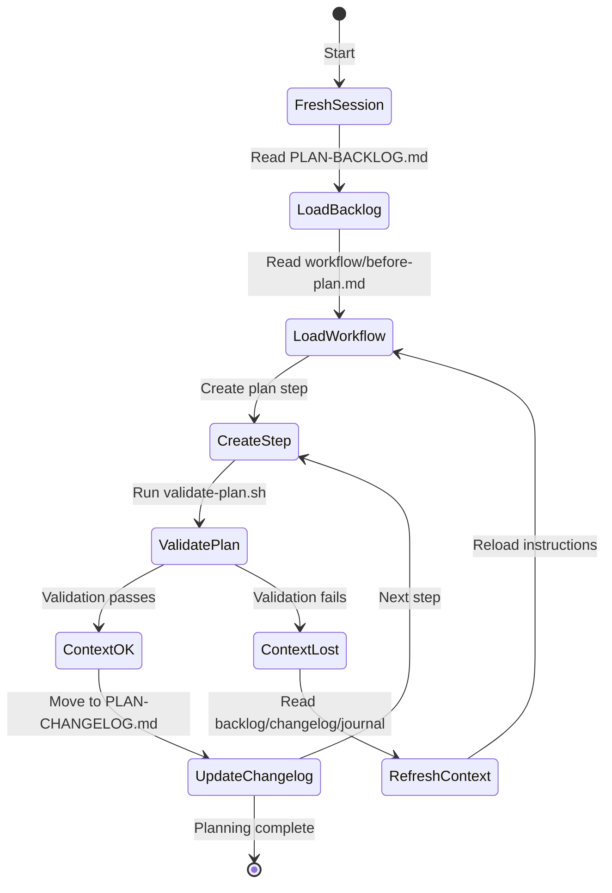
```mermaid
stateDiagram-v2
    [*] --> FreshSession: Start
    FreshSession --> LoadBacklog: Read PLAN-BACKLOG.md
    LoadBacklog --> LoadWorkflow: Read workflow/before-plan.md
    LoadWorkflow --> CreateStep: Create plan step
    CreateStep --> ValidatePlan: Run validate-plan.sh
    
    ValidatePlan --> ContextOK: Validation passes
    ValidatePlan --> ContextLost: Validation fails
    
    ContextLost --> RefreshContext: Read backlog/changelog/journal
    RefreshContext --> LoadWorkflow: Reload instructions
    
    ContextOK --> UpdateChangelog: Move to PLAN-CHANGELOG.md
    UpdateChangelog --> CreateStep: Next step
    UpdateChangelog --> [*]: Planning complete
```

#### 2. Context Flow Visualization

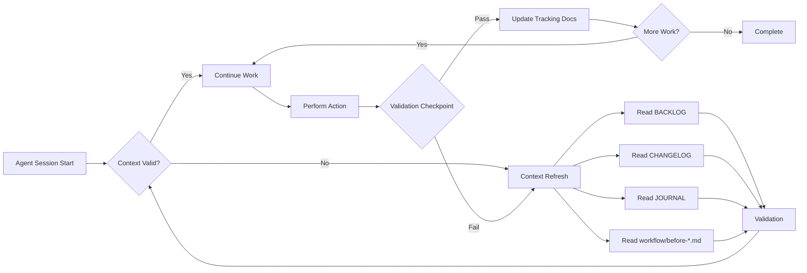
```mermaid
graph LR
    A[Agent Session Start] --> B{Context Valid?}
    B -->|Yes| C[Continue Work]
    B -->|No| D[Context Refresh]
    
    D --> E[Read BACKLOG]
    D --> F[Read CHANGELOG]
    D --> G[Read JOURNAL]
    D --> H[Read workflow/before-*.md]
    
    E --> I[Validation]
    F --> I
    G --> I
    H --> I
    
    I --> B
    
    C --> J[Perform Action]
    J --> K{Validation Checkpoint}
    K -->|Pass| L[Update Tracking Docs]
    K -->|Fail| D
    L --> M{More Work?}
    M -->|Yes| C
    M -->|No| N[Complete]
```

#### 3. Three-Layer Context Tracking

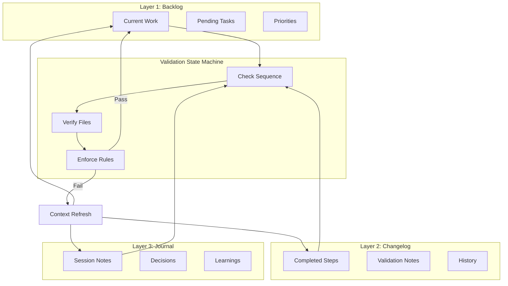
```mermaid
graph TD
    subgraph "Layer 1: Backlog"
        B1[Current Work]
        B2[Pending Tasks]
        B3[Priorities]
    end
    
    subgraph "Layer 2: Changelog"
        C1[Completed Steps]
        C2[Validation Notes]
        C3[History]
    end
    
    subgraph "Layer 3: Journal"
        J1[Session Notes]
        J2[Decisions]
        J3[Learnings]
    end
    
    subgraph "Validation State Machine"
        V1[Check Sequence]
        V2[Verify Files]
        V3[Enforce Rules]
    end
    
    B1 --> V1
    C1 --> V1
    J1 --> V1
    
    V1 --> V2
    V2 --> V3
    V3 -->|Pass| B1
    V3 -->|Fail| RefreshAll[Context Refresh]
    
    RefreshAll --> B1
    RefreshAll --> C1
    RefreshAll --> J1
```

### Proposed Features

1. **Auto-generate Context Diagrams**
   - Parse backlog/changelog/journal files
   - Generate Mermaid diagrams automatically
   - Show current state in real-time

2. **Context Metrics Dashboard**
   - Track context refresh frequency
   - Measure validation success rate
   - Visualize context "health"

3. **Interactive Timeline**
   - Show context state over time
   - Highlight context loss events
   - Map recovery actions

4. **Git Integration**
   - Generate diagram from git history
   - Show context state at each commit
   - Visualize workflow branch transitions

### Example Output

A script that generates:

```bash
./scripts/visualize-context.sh
```

Output:
- `context-flow.md` - Mermaid diagram of current context
- `context-timeline.md` - Historical context changes
- `context-health.md` - Metrics and health report

### Benefits

- **Transparency** - Make LLM context management visible
- **Debugging** - Quickly identify context issues
- **Education** - Help users understand the system
- **Documentation** - Auto-generate visual guides

### Next Steps

1. Implement basic context state parsing
2. Generate simple Mermaid diagrams
3. Add to validation scripts
4. Create visualization script
5. Integrate with Makefile
6. Document in README

---

## LLM Knowledge Visualization

### Concept

Visualize knowledge extraction and relationships from Markdown documents using Mermaid diagrams to create executable knowledge graphs.

### Use Cases

1. **Knowledge Graph Exploration**
   - Visualize document relationships
   - Show concept connections
   - Map knowledge dependencies

2. **Documentation Navigation**
   - Auto-generate table of contents as graph
   - Show cross-references visually
   - Create interactive knowledge maps

3. **AI Knowledge Extraction**
   - Parse Markdown into knowledge nodes
   - Extract entities and relationships
   - Generate semantic knowledge graphs

4. **Learning Path Visualization**
   - Show prerequisite dependencies
   - Map learning progression
   - Visualize skill trees

### Implementation Ideas

#### 1. Document Relationship Graph

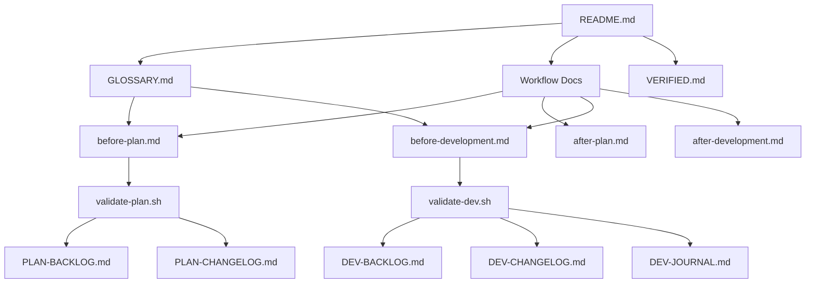
```mermaid
graph TD
    README[README.md] --> GLOSSARY[GLOSSARY.md]
    README --> WORKFLOW[Workflow Docs]
    README --> VERIFICATION[VERIFIED.md]
    
    WORKFLOW --> BP[before-plan.md]
    WORKFLOW --> AP[after-plan.md]
    WORKFLOW --> BD[before-development.md]
    WORKFLOW --> AD[after-development.md]
    
    BP --> VP[validate-plan.sh]
    BD --> VD[validate-dev.sh]
    
    VP --> BACKLOG[PLAN-BACKLOG.md]
    VP --> CHANGELOG[PLAN-CHANGELOG.md]
    
    VD --> DB[DEV-BACKLOG.md]
    VD --> DC[DEV-CHANGELOG.md]
    VD --> DJ[DEV-JOURNAL.md]
    
    GLOSSARY --> BP
    GLOSSARY --> BD
```

#### 2. Concept Dependency Graph

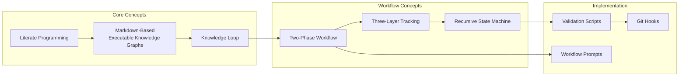
```mermaid
graph LR
    subgraph "Core Concepts"
        LPE[Literate Programming]
        MBEKG[Markdown-Based<br/>Executable Knowledge Graphs]
        KL[Knowledge Loop]
    end
    
    subgraph "Workflow Concepts"
        TWP[Two-Phase Workflow]
        TLT[Three-Layer Tracking]
        RSM[Recursive State Machine]
    end
    
    subgraph "Implementation"
        VS[Validation Scripts]
        GH[Git Hooks]
        WP[Workflow Prompts]
    end
    
    LPE --> MBEKG
    MBEKG --> KL
    
    KL --> TWP
    TWP --> TLT
    TLT --> RSM
    
    RSM --> VS
    VS --> GH
    TWP --> WP
```

#### 3. Knowledge Extraction from Markdown

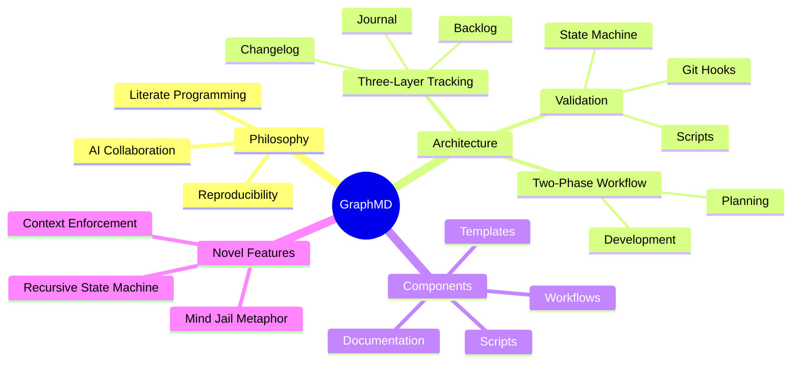
```mermaid
mindmap
  root((GraphMD))
    Philosophy
      Literate Programming
      AI Collaboration
      Reproducibility
    Architecture
      Two-Phase Workflow
        Planning
        Development
      Three-Layer Tracking
        Backlog
        Changelog
        Journal
      Validation
        Scripts
        Git Hooks
        State Machine
    Components
      Templates
      Scripts
      Workflows
      Documentation
    Novel Features
      Recursive State Machine
      Context Enforcement
      Mind Jail Metaphor
```

#### 4. Entity-Relationship Diagram

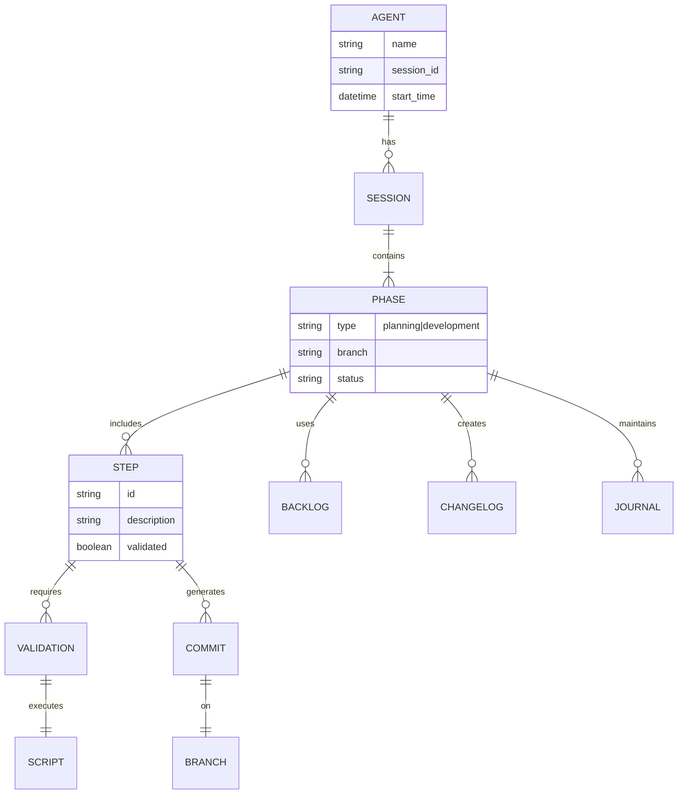
```mermaid
erDiagram
    AGENT ||--o{ SESSION : has
    SESSION ||--|{ PHASE : contains
    PHASE ||--o{ STEP : includes
    STEP ||--o{ VALIDATION : requires
    VALIDATION ||--|| SCRIPT : executes
    
    PHASE ||--o{ BACKLOG : uses
    PHASE ||--o{ CHANGELOG : creates
    PHASE ||--o{ JOURNAL : maintains
    
    STEP ||--o{ COMMIT : generates
    COMMIT ||--|| BRANCH : on
    
    AGENT {
        string name
        string session_id
        datetime start_time
    }
    
    PHASE {
        string type "planning|development"
        string branch
        string status
    }
    
    STEP {
        string id
        string description
        boolean validated
    }
```

#### 5. Workflow Timeline

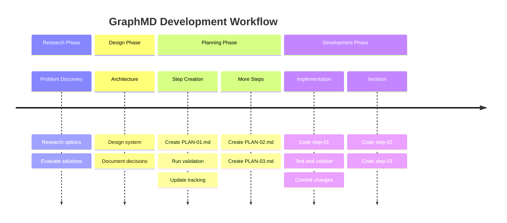
```mermaid
timeline
    title GraphMD Development Workflow
    section Research Phase
        Problem Discovery : Research options
                          : Evaluate solutions
    section Design Phase
        Architecture : Design system
                     : Document decisions
    section Planning Phase
        Step Creation : Create PLAN-01.md
                      : Run validation
                      : Update tracking
        More Steps : Create PLAN-02.md
                   : Create PLAN-03.md
    section Development Phase
        Implementation : Code step-01
                       : Test and validate
                       : Commit changes
        Iteration : Code step-02
                  : Code step-03
```

### Proposed Features

1. **Auto-generate Knowledge Graphs**
   - Parse Markdown headings and links
   - Extract entities and relationships
   - Generate Mermaid diagrams automatically

2. **Semantic Link Detection**
   - Identify concept references
   - Find implicit relationships
   - Suggest missing links

3. **Knowledge Metrics**
   - Measure document connectivity
   - Identify knowledge gaps
   - Calculate concept centrality

4. **Interactive Knowledge Browser**
   - Click to navigate graph
   - Filter by concept type
   - Show/hide detail levels

### Example Script

```bash
# Generate knowledge graph from Markdown files
./scripts/knowledge/extract-graph.sh

# Visualize specific concepts
./scripts/knowledge/visualize-concept.sh "Validation"

# Show all relationships for a document
./scripts/knowledge/document-relationships.sh README.md
```

### Implementation Approach

1. **Parser**
   - Extract headings (H1, H2, H3)
   - Parse Markdown links
   - Identify code blocks and examples
   - Extract frontmatter metadata

2. **Graph Builder**
   - Create nodes from concepts
   - Create edges from links
   - Infer implicit relationships
   - Calculate node properties

3. **Visualizer**
   - Generate Mermaid syntax
   - Choose diagram type (graph, mindmap, timeline, etc.)
   - Apply layout algorithms
   - Add styling and colors

4. **Integration**
   - Add to validation scripts
   - Generate on commit
   - Update documentation
   - Create interactive HTML

### Benefits

- **Discoverability** - Find related concepts easily
- **Understanding** - See system structure visually
- **Navigation** - Jump between related docs
- **Quality** - Identify missing documentation
- **Onboarding** - Help new users learn faster

### Use Cases in GraphMD

1. **Workflow Visualization**
   - Show planning → development flow
   - Map validation checkpoints
   - Visualize context tracking

2. **Documentation Structure**
   - Generate site maps
   - Show document hierarchy
   - Create navigation aids

3. **Concept Learning**
   - Build concept dependency trees
   - Show learning paths
   - Create study guides

4. **System Architecture**
   - Visualize component relationships
   - Show data flow
   - Map interactions

### Next Steps

1. Create Markdown parser for headings and links
2. Build knowledge graph data structure
3. Generate basic Mermaid diagrams
4. Add to documentation workflow
5. Create interactive viewer
6. Document usage patterns

---

## LLM Domain Knowledge Visualization

### Concept

Visualize domain-specific knowledge, ontologies, and conceptual models using Mermaid diagrams to help LLMs understand and reason about specific problem domains.

### Use Cases

1. **Domain Modeling**
   - Visualize domain entities and relationships
   - Show business rules and constraints
   - Map domain-specific workflows

2. **Ontology Visualization**
   - Display class hierarchies
   - Show property relationships
   - Visualize taxonomies

3. **LLM Training Context**
   - Provide domain knowledge as visual context
   - Help LLMs understand domain constraints
   - Guide LLM reasoning with structured knowledge

4. **Domain-Driven Design**
   - Model bounded contexts
   - Show aggregate relationships
   - Visualize domain events

### Implementation Ideas

#### 1. Domain Entity Model

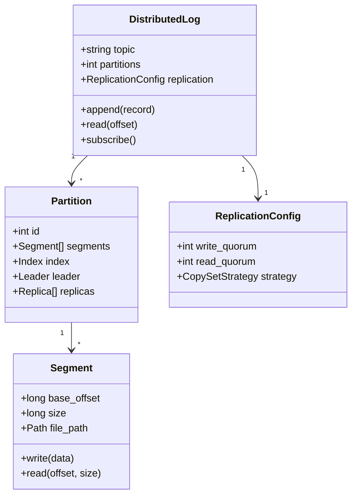
```mermaid
classDiagram
    class DistributedLog {
        +string topic
        +int partitions
        +ReplicationConfig replication
        +append(record)
        +read(offset)
        +subscribe()
    }
    
    class Partition {
        +int id
        +Segment[] segments
        +Index index
        +Leader leader
        +Replica[] replicas
    }
    
    class Segment {
        +long base_offset
        +long size
        +Path file_path
        +write(data)
        +read(offset, size)
    }
    
    class ReplicationConfig {
        +int write_quorum
        +int read_quorum
        +CopySetStrategy strategy
    }
    
    DistributedLog "1" --> "*" Partition
    Partition "1" --> "*" Segment
    DistributedLog "1" --> "1" ReplicationConfig
```

#### 2. Domain Workflow

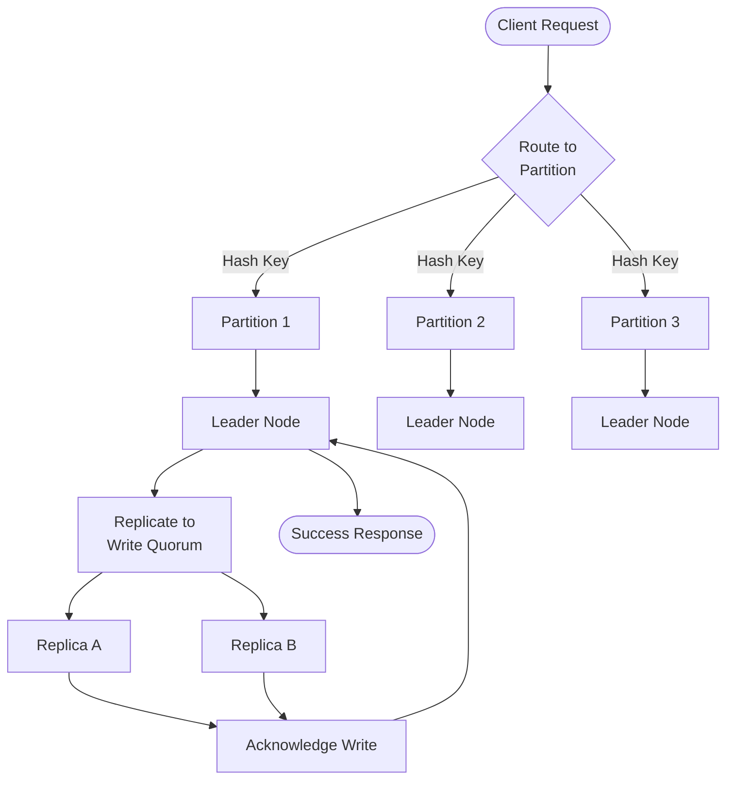
```mermaid
flowchart TD
    Start([Client Request]) --> Route{Route to<br/>Partition}
    Route -->|Hash Key| P1[Partition 1]
    Route -->|Hash Key| P2[Partition 2]
    Route -->|Hash Key| P3[Partition 3]
    
    P1 --> Leader1[Leader Node]
    Leader1 --> Replicate1[Replicate to<br/>Write Quorum]
    Replicate1 --> R1A[Replica A]
    Replicate1 --> R1B[Replica B]
    
    R1A --> Ack1[Acknowledge Write]
    R1B --> Ack1
    Ack1 --> Leader1
    Leader1 --> Success([Success Response])
    
    P2 --> Leader2[Leader Node]
    P3 --> Leader3[Leader Node]
```

#### 3. Domain Ontology

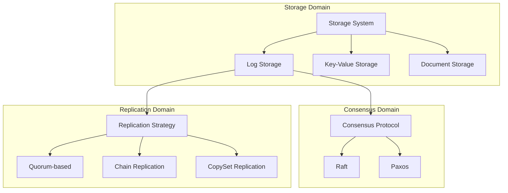
```mermaid
graph TB
    subgraph "Storage Domain"
        Storage[Storage System]
        Log[Log Storage]
        KV[Key-Value Storage]
        Doc[Document Storage]
        
        Storage --> Log
        Storage --> KV
        Storage --> Doc
    end
    
    subgraph "Consensus Domain"
        Consensus[Consensus Protocol]
        Raft[Raft]
        Paxos[Paxos]
        
        Consensus --> Raft
        Consensus --> Paxos
    end
    
    subgraph "Replication Domain"
        Replication[Replication Strategy]
        Quorum[Quorum-based]
        Chain[Chain Replication]
        CopySet[CopySet Replication]
        
        Replication --> Quorum
        Replication --> Chain
        Replication --> CopySet
    end
    
    Log --> Consensus
    Log --> Replication
```

#### 4. Domain State Machine

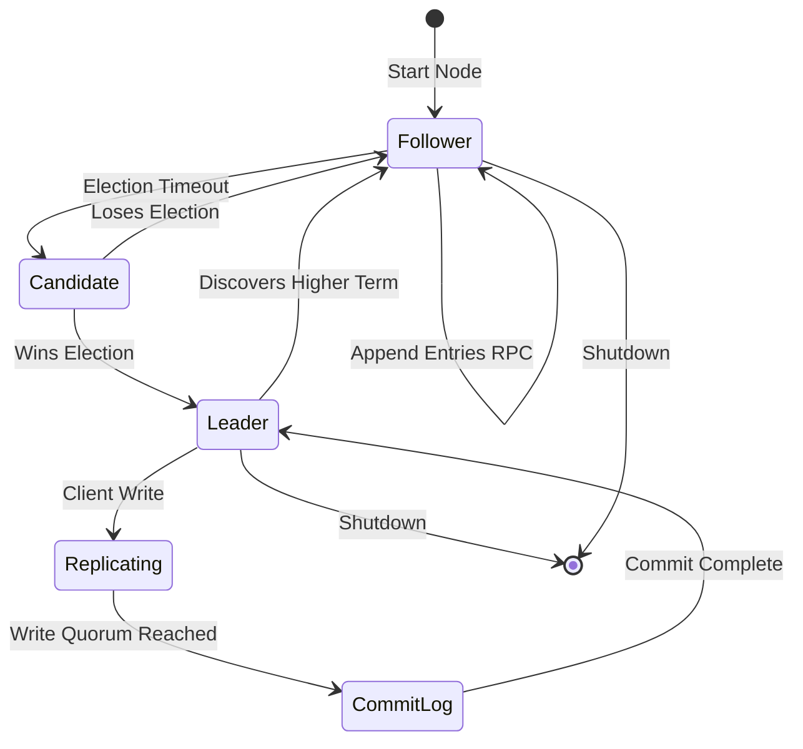
```mermaid
stateDiagram-v2
    [*] --> Follower: Start Node
    
    Follower --> Candidate: Election Timeout
    Candidate --> Leader: Wins Election
    Candidate --> Follower: Loses Election
    
    Leader --> Follower: Discovers Higher Term
    Follower --> Follower: Append Entries RPC
    
    Leader --> Replicating: Client Write
    Replicating --> CommitLog: Write Quorum Reached
    CommitLog --> Leader: Commit Complete
    
    Leader --> [*]: Shutdown
    Follower --> [*]: Shutdown
```

#### 5. Domain Event Flow

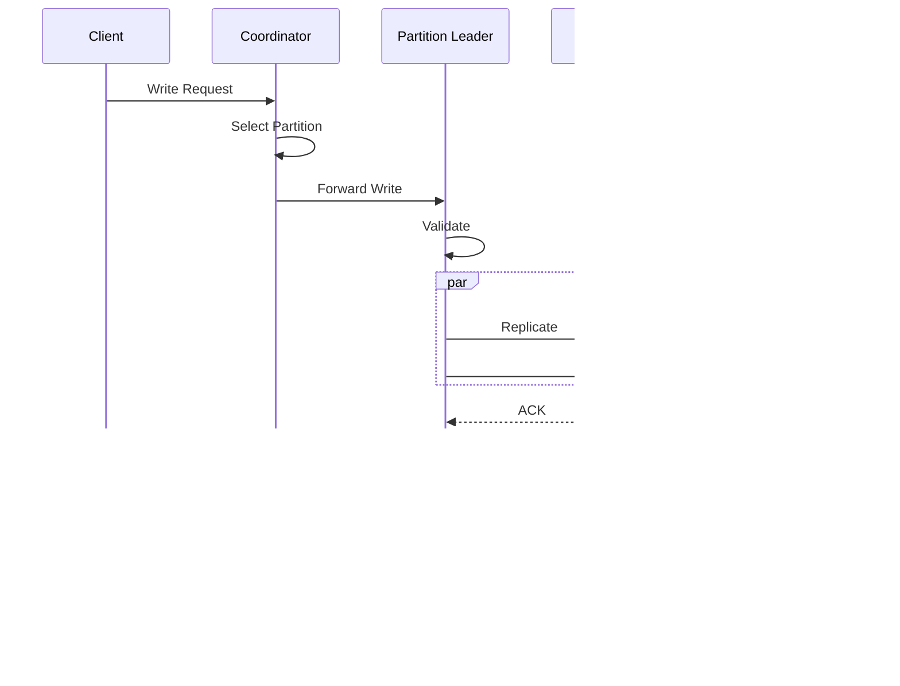
```mermaid
sequenceDiagram
    participant Client
    participant Coordinator
    participant Partition Leader
    participant Replica 1
    participant Replica 2
    
    Client->>Coordinator: Write Request
    Coordinator->>Coordinator: Select Partition
    Coordinator->>Partition Leader: Forward Write
    
    Partition Leader->>Partition Leader: Validate
    
    par Parallel Replication
        Partition Leader->>Replica 1: Replicate
        Partition Leader->>Replica 2: Replicate
    end
    
    Replica 1-->>Partition Leader: ACK
    Replica 2-->>Partition Leader: ACK
    
    Partition Leader->>Partition Leader: Check Quorum
    Partition Leader->>Coordinator: Write Complete
    Coordinator->>Client: Success Response
```

#### 6. Domain Taxonomy

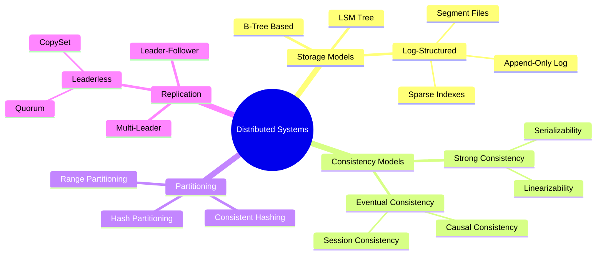
```mermaid
mindmap
  root((Distributed Systems))
    Storage Models
      Log-Structured
        Append-Only Log
        Segment Files
        Sparse Indexes
      B-Tree Based
      LSM Tree
    Consistency Models
      Strong Consistency
        Linearizability
        Serializability
      Eventual Consistency
        Causal Consistency
        Session Consistency
    Partitioning
      Hash Partitioning
      Range Partitioning
      Consistent Hashing
    Replication
      Leader-Follower
      Multi-Leader
      Leaderless
        Quorum
        CopySet
```

### Proposed Features

1. **Domain Model Generator**
   - Parse domain models from Markdown
   - Generate class diagrams automatically
   - Sync with code structure

2. **Interactive Domain Browser**
   - Navigate domain concepts visually
   - Drill down into details
   - Show relationships dynamically

3. **Domain Validation**
   - Check domain model consistency
   - Validate domain constraints
   - Verify business rules

4. **LLM Domain Context Loading**
   - Automatically load domain diagrams as context
   - Provide domain knowledge to LLM
   - Guide LLM reasoning with domain rules

### Example: Pyralog Domain Model

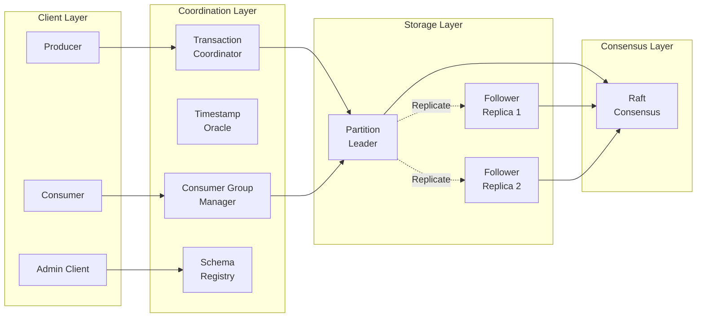
```mermaid
graph LR
    subgraph "Client Layer"
        Producer[Producer]
        Consumer[Consumer]
        Admin[Admin Client]
    end
    
    subgraph "Coordination Layer"
        TC[Transaction<br/>Coordinator]
        TSO[Timestamp<br/>Oracle]
        CG[Consumer Group<br/>Manager]
        SR[Schema<br/>Registry]
    end
    
    subgraph "Storage Layer"
        Leader[Partition<br/>Leader]
        Follower1[Follower<br/>Replica 1]
        Follower2[Follower<br/>Replica 2]
    end
    
    subgraph "Consensus Layer"
        Raft[Raft<br/>Consensus]
    end
    
    Producer --> TC
    TC --> Leader
    Consumer --> CG
    CG --> Leader
    Admin --> SR
    
    Leader --> Raft
    Follower1 --> Raft
    Follower2 --> Raft
    
    Leader -.Replicate.-> Follower1
    Leader -.Replicate.-> Follower2
```

### Example Script

```bash
# Generate domain model from documentation
./scripts/domain/extract-model.sh docs/

# Visualize specific domain
./scripts/domain/visualize.sh "Replication"

# Validate domain model consistency
./scripts/domain/validate-model.sh

# Load domain context for LLM
./scripts/domain/load-context.sh --domain distributed-systems
```

### Implementation Approach

1. **Domain Parser**
   - Extract domain concepts from Markdown
   - Parse domain vocabulary
   - Identify relationships and constraints

2. **Ontology Builder**
   - Create formal domain model
   - Define class hierarchies
   - Specify properties and relationships

3. **Diagram Generator**
   - Choose appropriate diagram type
   - Generate Mermaid syntax
   - Apply domain-specific styling

4. **LLM Integration**
   - Load domain diagrams as context
   - Provide domain vocabulary
   - Guide reasoning with domain rules

### Benefits

- **Shared Understanding** - Common domain language
- **LLM Guidance** - Structured domain knowledge
- **Documentation** - Visual domain models
- **Validation** - Check domain consistency
- **Communication** - Bridge business and technical

### Domain-Specific Examples

#### Software Architecture Domain

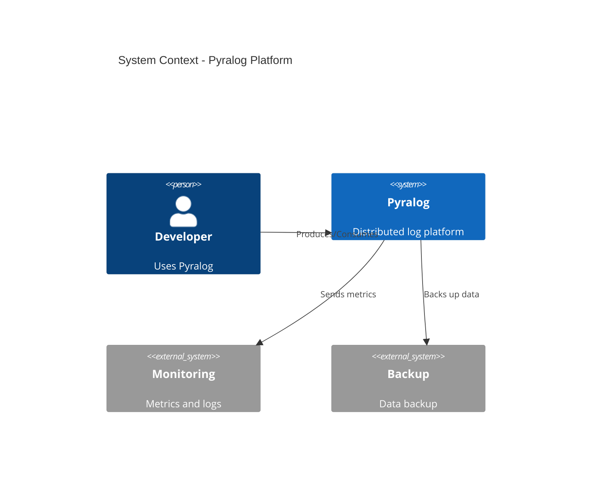
```mermaid
C4Context
    title System Context - Pyralog Platform
    
    Person(user, "Developer", "Uses Pyralog")
    System(pyralog, "Pyralog", "Distributed log platform")
    System_Ext(monitoring, "Monitoring", "Metrics and logs")
    System_Ext(backup, "Backup", "Data backup")
    
    Rel(user, pyralog, "Produces/Consumes")
    Rel(pyralog, monitoring, "Sends metrics")
    Rel(pyralog, backup, "Backs up data")
```

#### Data Flow Domain

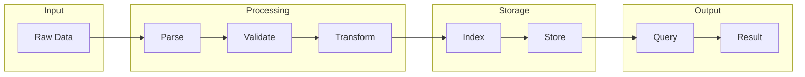
```mermaid
graph LR
    subgraph "Input"
        Raw[Raw Data]
    end
    
    subgraph "Processing"
        Parse[Parse]
        Validate[Validate]
        Transform[Transform]
    end
    
    subgraph "Storage"
        Index[Index]
        Store[Store]
    end
    
    subgraph "Output"
        Query[Query]
        Result[Result]
    end
    
    Raw --> Parse
    Parse --> Validate
    Validate --> Transform
    Transform --> Index
    Index --> Store
    Store --> Query
    Query --> Result
```

#### Temporal Domain

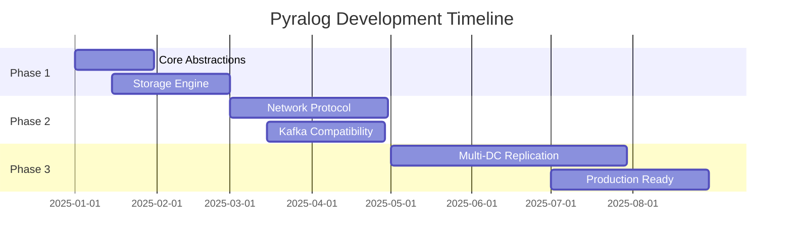
```mermaid
gantt
    title Pyralog Development Timeline
    dateFormat  YYYY-MM-DD
    section Phase 1
    Core Abstractions     :2025-01-01, 30d
    Storage Engine       :2025-01-15, 45d
    section Phase 2
    Network Protocol     :2025-03-01, 60d
    Kafka Compatibility  :2025-03-15, 45d
    section Phase 3
    Multi-DC Replication :2025-05-01, 90d
    Production Ready     :2025-07-01, 60d
```

### Next Steps

1. Create domain model parser
2. Build domain ontology structure
3. Generate domain-specific diagrams
4. Integrate with LLM context loading
5. Validate domain model consistency
6. Document domain modeling patterns

---

## DSL for Formal Verification Based on Sulise

### Concept

Create a Domain-Specific Language (DSL) for formal verification of GraphMD workflows and AI-assisted development processes, built on [Sulise](https://github.com/pyralog/pyralog/blob/main/BATUTA.md#theoretical-foundation-sulise) - the category theory-based framework from Pyralog's Batuta language.

### Background: What is Sulise?

Sulise is a mathematical framework that unifies different computational models using category theory. It provides:

- **Categorical semantics** for workflows and data transformations
- **Formal composition** rules for operations
- **Type-safe transformations** between different query models
- **Mathematical proofs** of correctness

### Why Formal Verification for GraphMD?

GraphMD workflows involve:
1. **Complex state transitions** (planning → development)
2. **Context tracking** across multiple documents
3. **Validation checkpoints** that must be verified
4. **LLM interactions** with potential failure modes
5. **Git workflow** with branch and commit requirements

**Formal verification ensures:**
- ✅ Workflows cannot reach invalid states
- ✅ Context is never lost
- ✅ Validation rules are always enforced
- ✅ State transitions are mathematically proven correct

### Use Cases

1. **Workflow Verification**
   - Prove workflow completeness
   - Verify state machine correctness
   - Ensure all paths lead to valid states

2. **Context Integrity**
   - Prove context is preserved across sessions
   - Verify tracking document consistency
   - Ensure validation triggers correctly

3. **Validation Script Correctness**
   - Prove validation scripts catch all errors
   - Verify checkpoint enforcement
   - Ensure no invalid states pass validation

4. **LLM Interaction Safety**
   - Verify prompt-response contracts
   - Prove context loading completeness
   - Ensure error recovery correctness

### Implementation Ideas

#### 1. Workflow State Specification

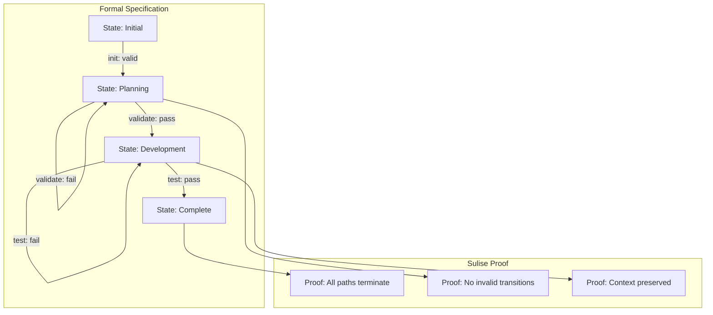
```mermaid
graph TD
    subgraph "Formal Specification"
        S1[State: Initial]
        S2[State: Planning]
        S3[State: Development]
        S4[State: Complete]
        
        S1 -->|init: valid| S2
        S2 -->|validate: pass| S3
        S2 -->|validate: fail| S2
        S3 -->|test: pass| S4
        S3 -->|test: fail| S3
    end
    
    subgraph "Sulise Proof"
        P1[Proof: All paths terminate]
        P2[Proof: No invalid transitions]
        P3[Proof: Context preserved]
    end
    
    S4 --> P1
    S2 --> P2
    S3 --> P3
```

#### 2. Category Theory Model

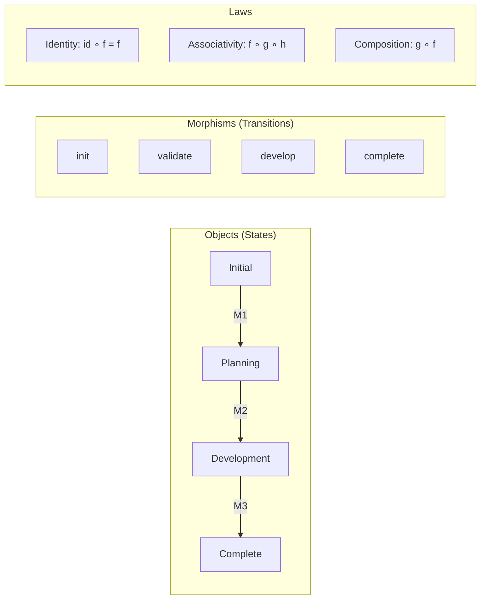
```mermaid
graph LR
    subgraph "Objects (States)"
        O1[Initial]
        O2[Planning]
        O3[Development]
        O4[Complete]
    end
    
    subgraph "Morphisms (Transitions)"
        M1[init]
        M2[validate]
        M3[develop]
        M4[complete]
    end
    
    O1 -->|M1| O2
    O2 -->|M2| O3
    O3 -->|M3| O4
    
    subgraph "Laws"
        L1[Identity: id ∘ f = f]
        L2[Associativity: f ∘ g ∘ h]
        L3[Composition: g ∘ f]
    end
```

#### 3. Verification Specification Example

```clojure
;; Sulise-based DSL for workflow verification

(defworkflow graphmd-planning
  "Formal specification of GraphMD planning phase"
  
  ;; States
  (defstate :initial
    :invariants [(empty? backlog)
                 (empty? changelog)])
  
  (defstate :planning
    :invariants [(valid-backlog? backlog)
                 (valid-changelog? changelog)
                 (sequence-markers-correct? backlog)])
  
  (defstate :complete
    :invariants [(empty? backlog)
                 (all-validated? changelog)])
  
  ;; Transitions
  (deftransition init [:initial → :planning]
    :preconditions [(project-initialized?)]
    :postconditions [(backlog-created?)
                     (workflow-loaded?)])
  
  (deftransition validate [:planning → :planning]
    :preconditions [(has-pending-steps? backlog)]
    :postconditions [(or (step-validated? step)
                         (context-refreshed?))]))
  
  ;; Verification goals
  (prove-termination "All workflows eventually complete")
  (prove-safety "No invalid states reachable")
  (prove-liveness "Progress always possible"))
```

#### 4. Context Tracking Verification

```clojure
;; Verify three-layer context tracking

(defcontext-system three-layer
  "Formal model of three-layer context tracking"
  
  (deflayer backlog
    :properties [:current-work :priorities]
    :invariants [(no-duplicates? :steps)
                 (valid-sequence? :markers)])
  
  (deflayer changelog
    :properties [:completed :validated]
    :invariants [(monotonic-increase? :count)
                 (timestamped? :entries)])
  
  (deflayer journal
    :properties [:decisions :learnings]
    :invariants [(session-bounded? :entries)])
  
  ;; Synchronization proof
  (prove-sync "Backlog and changelog stay consistent"
    (∀ [step]
      (→ (completed? step changelog)
          (removed? step backlog))))
  
  ;; Context preservation proof
  (prove-preservation "Context never lost"
    (∀ [session₁ session₂]
      (→ (follows? session₂ session₁)
          (⊆ (context session₁)
             (context session₂))))))
```

#### 5. Validation State Machine Proof

```clojure
;; Prove validation state machine correctness

(defstatemachiine validation-loop
  "Recursive validation with context recovery"
  
  (defstate :validate
    :entry [(check-sequence)
            (verify-files)
            (enforce-rules)])
  
  (defstate :pass
    :entry [(update-tracking)])
  
  (defstate :fail
    :entry [(refresh-context)
            (reload-instructions)])
  
  ;; Transitions
  (transition :validate → :pass
    :when (all-checks-pass?))
  
  (transition :validate → :fail
    :when (any-check-fails?))
  
  (transition :fail → :validate
    :when (context-restored?))
  
  ;; Proofs
  (prove-termination
    "Validation loop always terminates"
    (using :measure (context-refresh-count)
           :bound 3))
  
  (prove-correctness
    "Invalid states never pass validation"
    (∀ [state]
      (→ (invalid? state)
          (= (validate state) :fail)))))
```

### Proposed Features

1. **Formal Specification Language**
   - Write workflow specifications in DSL
   - Express state invariants and transitions
   - Define verification goals

2. **Automated Proof Generation**
   - Generate proofs from specifications
   - Use SMT solvers for verification
   - Provide proof certificates

3. **Runtime Verification**
   - Check invariants at runtime
   - Detect violations immediately
   - Generate diagnostic reports

4. **Visual Proof Inspector**
   - Visualize proof trees
   - Show proof steps interactively
   - Debug failed proofs

### Integration with GraphMD

```mermaid
graph TD
    subgraph "GraphMD Workflow"
        W1[Workflow Templates]
        W2[Validation Scripts]
        W3[Git Hooks]
    end
    
    subgraph "Sulise Verification"
        V1[Formal Specs]
        V2[Proof Engine]
        V3[Verification Results]
    end
    
    subgraph "Development"
        D1[Write Specs]
        D2[Run Verification]
        D3[Deploy Verified]
    end
    
    W1 --> V1
    W2 --> V1
    V1 --> V2
    V2 --> V3
    
    D1 --> V1
    V3 --> D2
    V3 --> D3
```

### Benefits

- **Correctness Guarantees** - Mathematical proofs of workflow correctness
- **Bug Prevention** - Catch errors before they happen
- **Documentation** - Formal specs serve as precise documentation
- **Confidence** - Know your workflows are proven correct
- **Compliance** - Provide verifiable evidence of correctness

### Example: Prove Planning Phase Correctness

```clojure
;; Complete formal verification example

(deftheorem planning-phase-correct
  "Planning phase always produces valid development plan"
  
  ;; Hypothesis
  (assume
    (initialized? project)
    (exists? workflow-templates)
    (exists? validation-scripts))
  
  ;; Workflow specification
  (defworkflow planning
    (step create-backlog
      :ensures (exists? PLAN-BACKLOG.md))
    
    (step create-steps
      :invariant (sequence-markers-valid?)
      :ensures (all-steps-have-sequence?))
    
    (step validate-each
      :requires (exists? step)
      :ensures (or (validated? step)
                   (context-refreshed?)))
    
    (step move-to-changelog
      :requires (validated? step)
      :ensures (in-changelog? step)
               (not-in-backlog? step)))
  
  ;; Theorem statement
  (prove
    (→ (completes? planning)
        (∧ (empty? PLAN-BACKLOG.md)
           (all-validated? PLAN-CHANGELOG.md)
           (ready-for? development-phase))))
  
  ;; Proof
  (by-induction steps
    (base-case empty-backlog)
    (inductive-step
      (assume (valid-after-n-steps n))
      (prove (valid-after-n-steps (+ n 1)))
      (using validation-loop-correctness))))
```

### Tooling

```bash
# Verify workflow specifications
graphmd verify workflow/

# Check specific theorem
graphmd verify --theorem planning-phase-correct

# Generate proof visualization
graphmd verify --visual --output proof.svg

# Runtime verification mode
graphmd validate --formal --prove-correctness
```

### Research Questions

1. **Expressiveness**: Can Sulise express all GraphMD workflow properties?
2. **Decidability**: Are all verification goals decidable?
3. **Performance**: Can proofs be generated quickly enough?
4. **Usability**: Can developers write formal specs easily?
5. **Integration**: How to integrate with existing validation scripts?

### Related Work

- **TLA+** - Temporal logic for distributed systems
- **Coq/Isabelle** - Proof assistants
- **Alloy** - Relational logic for models
- **Why3** - Deductive verification platform
- **Dafny** - Verification-aware programming language

### Next Steps

1. Study Sulise category theory foundations
2. Design DSL syntax for GraphMD workflows
3. Implement proof engine (using SMT solvers)
4. Create example proofs for validation scripts
5. Build visual proof inspector
6. Integrate with GraphMD Makefile
7. Document verification patterns

### Connection to Batuta

From [Batuta documentation](https://github.com/pyralog/pyralog/blob/main/BATUTA.md), Sulise provides:

> "A universal framework for reasoning about data transformations, queries, and distributed computations using category theory"

GraphMD can leverage Sulise's theoretical foundations to:
- Formalize workflow semantics
- Prove validation correctness
- Verify state machine properties
- Ensure LLM interaction safety

This brings **mathematical rigor** to AI-assisted development workflows.

---

## Future Research Topics

*Add more research ideas here as they emerge...*

- Real-time context monitoring
- LLM prompt optimization metrics
- Workflow pattern analysis
- Knowledge graph extraction from Markdown
- Natural language query interface for knowledge graphs
- Automated documentation generation from code
- Cross-project knowledge linking

