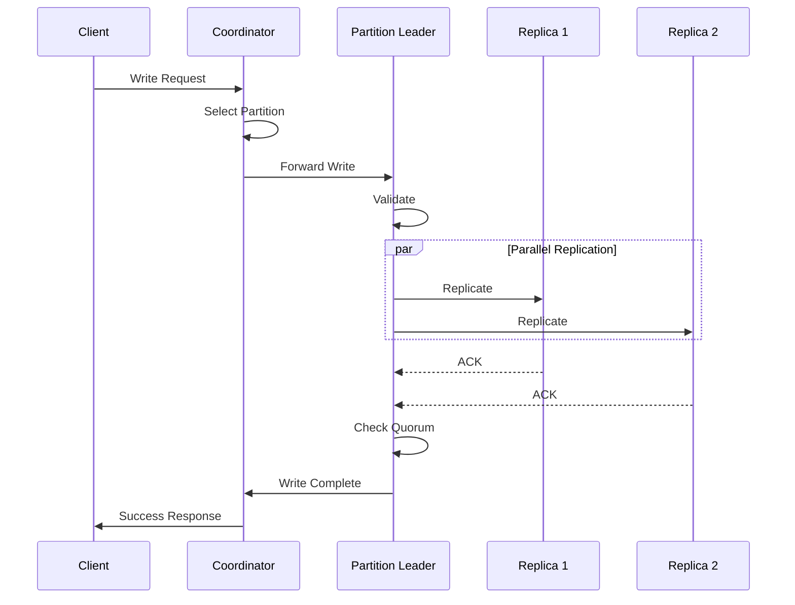

# Research Ideas

This document contains research ideas and experimental features for future GraphMD development.

**Links:**
- [← Back to README](README.md)
- [Read the Announcement on Medium](https://medium.com/@mail_36332/introducing-graphmd-turning-markdown-documents-into-executable-knowledge-graphs-6925d936423f)
- [Glossary](GLOSSARY.md)
- [Ecosystem Vision](ECOSYSTEM.md)

## Table of Contents

- [LLM Context Visualization](#llm-context-visualization)
- [LLM Knowledge Visualization](#llm-knowledge-visualization)
- [LLM Domain Knowledge Visualization](#llm-domain-knowledge-visualization)

---

## LLM Context Visualization

### Concept

Visualize LLM context flow and state transitions using Mermaid diagrams to help developers understand:

- How context flows through the workflow phases
- When context is loaded/refreshed
- What documents are in context at each step
- Context loss points and recovery mechanisms

### Use Cases

1. **Debugging Context Loss**
   - Visualize where context was lost
   - Show recovery paths taken
   - Highlight validation checkpoints

2. **Workflow Understanding**
   - Show the complete context lifecycle
   - Illustrate document relationships
   - Map prompt → action → result chains

3. **Documentation**
   - Auto-generate workflow diagrams
   - Create visual guides for new users
   - Show best practices visually

### Implementation Ideas

#### 1. Context State Diagram


#### 2. Context Flow Visualization


#### 3. Three-Layer Context Tracking


### Proposed Features

1. **Auto-generate Context Diagrams**
   - Parse backlog/changelog/journal files
   - Generate Mermaid diagrams automatically
   - Show current state in real-time

2. **Context Metrics Dashboard**
   - Track context refresh frequency
   - Measure validation success rate
   - Visualize context "health"

3. **Interactive Timeline**
   - Show context state over time
   - Highlight context loss events
   - Map recovery actions

4. **Git Integration**
   - Generate diagram from git history
   - Show context state at each commit
   - Visualize workflow branch transitions

### Example Output

A script that generates:

```bash
./scripts/visualize-context.sh
```

Output:
- `context-flow.md` - Mermaid diagram of current context
- `context-timeline.md` - Historical context changes
- `context-health.md` - Metrics and health report

### Benefits

- **Transparency** - Make LLM context management visible
- **Debugging** - Quickly identify context issues
- **Education** - Help users understand the system
- **Documentation** - Auto-generate visual guides

### Next Steps

1. Implement basic context state parsing
2. Generate simple Mermaid diagrams
3. Add to validation scripts
4. Create visualization script
5. Integrate with Makefile
6. Document in README

---

## LLM Knowledge Visualization

### Concept

Visualize knowledge extraction and relationships from Markdown documents using Mermaid diagrams to create executable knowledge graphs.

### Use Cases

1. **Knowledge Graph Exploration**
   - Visualize document relationships
   - Show concept connections
   - Map knowledge dependencies

2. **Documentation Navigation**
   - Auto-generate table of contents as graph
   - Show cross-references visually
   - Create interactive knowledge maps

3. **AI Knowledge Extraction**
   - Parse Markdown into knowledge nodes
   - Extract entities and relationships
   - Generate semantic knowledge graphs

4. **Learning Path Visualization**
   - Show prerequisite dependencies
   - Map learning progression
   - Visualize skill trees

### Implementation Ideas

#### 1. Document Relationship Graph


#### 2. Concept Dependency Graph


#### 3. Knowledge Extraction from Markdown


#### 4. Entity-Relationship Diagram


#### 5. Workflow Timeline


### Proposed Features

1. **Auto-generate Knowledge Graphs**
   - Parse Markdown headings and links
   - Extract entities and relationships
   - Generate Mermaid diagrams automatically

2. **Semantic Link Detection**
   - Identify concept references
   - Find implicit relationships
   - Suggest missing links

3. **Knowledge Metrics**
   - Measure document connectivity
   - Identify knowledge gaps
   - Calculate concept centrality

4. **Interactive Knowledge Browser**
   - Click to navigate graph
   - Filter by concept type
   - Show/hide detail levels

### Example Script

```bash
# Generate knowledge graph from Markdown files
./scripts/knowledge/extract-graph.sh

# Visualize specific concepts
./scripts/knowledge/visualize-concept.sh "Validation"

# Show all relationships for a document
./scripts/knowledge/document-relationships.sh README.md
```

### Implementation Approach

1. **Parser**
   - Extract headings (H1, H2, H3)
   - Parse Markdown links
   - Identify code blocks and examples
   - Extract frontmatter metadata

2. **Graph Builder**
   - Create nodes from concepts
   - Create edges from links
   - Infer implicit relationships
   - Calculate node properties

3. **Visualizer**
   - Generate Mermaid syntax
   - Choose diagram type (graph, mindmap, timeline, etc.)
   - Apply layout algorithms
   - Add styling and colors

4. **Integration**
   - Add to validation scripts
   - Generate on commit
   - Update documentation
   - Create interactive HTML

### Benefits

- **Discoverability** - Find related concepts easily
- **Understanding** - See system structure visually
- **Navigation** - Jump between related docs
- **Quality** - Identify missing documentation
- **Onboarding** - Help new users learn faster

### Use Cases in GraphMD

1. **Workflow Visualization**
   - Show planning → development flow
   - Map validation checkpoints
   - Visualize context tracking

2. **Documentation Structure**
   - Generate site maps
   - Show document hierarchy
   - Create navigation aids

3. **Concept Learning**
   - Build concept dependency trees
   - Show learning paths
   - Create study guides

4. **System Architecture**
   - Visualize component relationships
   - Show data flow
   - Map interactions

### Next Steps

1. Create Markdown parser for headings and links
2. Build knowledge graph data structure
3. Generate basic Mermaid diagrams
4. Add to documentation workflow
5. Create interactive viewer
6. Document usage patterns

---

## LLM Domain Knowledge Visualization

### Concept

Visualize domain-specific knowledge, ontologies, and conceptual models using Mermaid diagrams to help LLMs understand and reason about specific problem domains.

### Use Cases

1. **Domain Modeling**
   - Visualize domain entities and relationships
   - Show business rules and constraints
   - Map domain-specific workflows

2. **Ontology Visualization**
   - Display class hierarchies
   - Show property relationships
   - Visualize taxonomies

3. **LLM Training Context**
   - Provide domain knowledge as visual context
   - Help LLMs understand domain constraints
   - Guide LLM reasoning with structured knowledge

4. **Domain-Driven Design**
   - Model bounded contexts
   - Show aggregate relationships
   - Visualize domain events

### Implementation Ideas

#### 1. Domain Entity Model


#### 2. Domain Workflow


#### 3. Domain Ontology


#### 4. Domain State Machine


#### 5. Domain Event Flow



#### 6. Domain Taxonomy


### Proposed Features

1. **Domain Model Generator**
   - Parse domain models from Markdown
   - Generate class diagrams automatically
   - Sync with code structure

2. **Interactive Domain Browser**
   - Navigate domain concepts visually
   - Drill down into details
   - Show relationships dynamically

3. **Domain Validation**
   - Check domain model consistency
   - Validate domain constraints
   - Verify business rules

4. **LLM Domain Context Loading**
   - Automatically load domain diagrams as context
   - Provide domain knowledge to LLM
   - Guide LLM reasoning with domain rules

### Example: Pyralog Domain Model


### Example Script

```bash
# Generate domain model from documentation
./scripts/domain/extract-model.sh docs/

# Visualize specific domain
./scripts/domain/visualize.sh "Replication"

# Validate domain model consistency
./scripts/domain/validate-model.sh

# Load domain context for LLM
./scripts/domain/load-context.sh --domain distributed-systems
```

### Implementation Approach

1. **Domain Parser**
   - Extract domain concepts from Markdown
   - Parse domain vocabulary
   - Identify relationships and constraints

2. **Ontology Builder**
   - Create formal domain model
   - Define class hierarchies
   - Specify properties and relationships

3. **Diagram Generator**
   - Choose appropriate diagram type
   - Generate Mermaid syntax
   - Apply domain-specific styling

4. **LLM Integration**
   - Load domain diagrams as context
   - Provide domain vocabulary
   - Guide reasoning with domain rules

### Benefits

- **Shared Understanding** - Common domain language
- **LLM Guidance** - Structured domain knowledge
- **Documentation** - Visual domain models
- **Validation** - Check domain consistency
- **Communication** - Bridge business and technical

### Domain-Specific Examples

#### Software Architecture Domain


#### Data Flow Domain


#### Temporal Domain


### Next Steps

1. Create domain model parser
2. Build domain ontology structure
3. Generate domain-specific diagrams
4. Integrate with LLM context loading
5. Validate domain model consistency
6. Document domain modeling patterns

---

## Future Research Topics

*Add more research ideas here as they emerge...*

- Real-time context monitoring
- LLM prompt optimization metrics
- Workflow pattern analysis
- Knowledge graph extraction from Markdown
- Natural language query interface for knowledge graphs
- Automated documentation generation from code
- Cross-project knowledge linking

